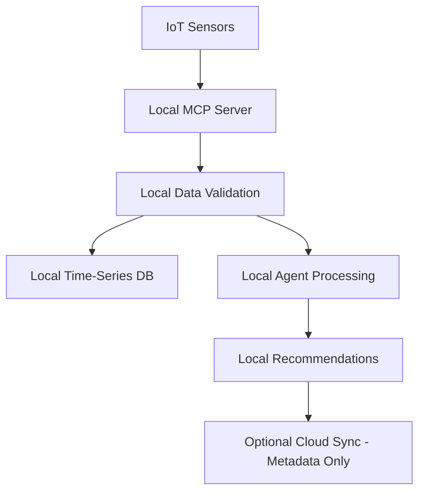
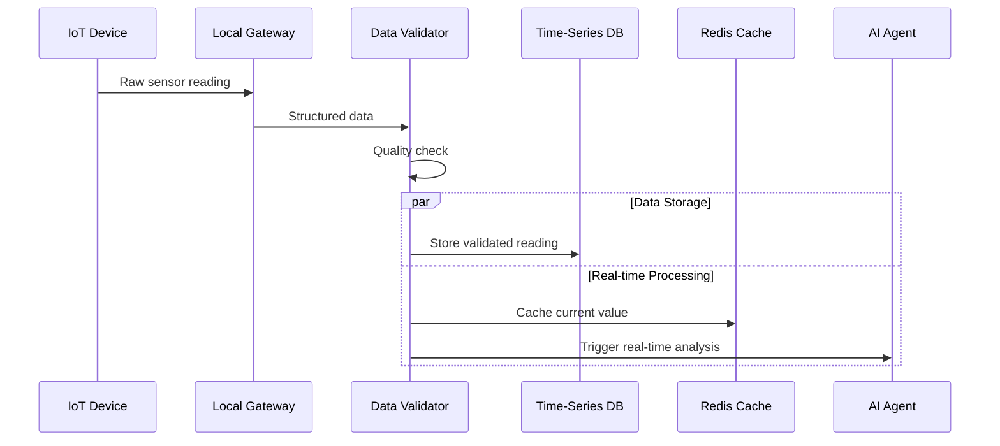

# EAIO Integration Architecture Patterns
**Architecture Mode (A.*) - Integration Design**

## 🎯 Overview

The EAIO integration architecture defines standardized patterns for component communication, external system integration, and data flow orchestration while maintaining local-first processing principles.

## 🔗 Core Integration Patterns

### 1. MCP-First Integration Pattern
**Pattern**: All external tools and data sources accessed through MCP protocol
**Benefit**: Standardized tool interface, simplified agent development

```python
# MCP Integration Controller
class MCPIntegrationController:
    async def integrate_energy_system(self, system_config: EnergySystemConfig):
        # Discover available MCP tools
        tools = await self.mcp_orchestrator.discover_tools(
            category="energy_management"
        )
        
        # Register energy system endpoints
        energy_server = MCPServer(
            name=f"energy_{system_config.system_id}",
            tools=self.generate_system_tools(system_config)
        )
        
        await self.mcp_orchestrator.register_server(energy_server)
        return energy_server
```

### 2. Event-Driven Agent Coordination
**Pattern**: Agents communicate through event bus for loose coupling
**Benefit**: Scalable, resilient, and maintainable agent interactions

```python
# Agent Event System
class AgentEventBus:
    def __init__(self):
        self.subscribers: Dict[str, List[Callable]] = {}
        
    async def publish(self, event_type: str, event_data: dict):
        event = AgentEvent(
            type=event_type,
            data=event_data,
            timestamp=datetime.utcnow(),
            source_agent=self.current_agent_id
        )
        
        # Parallel notification to all subscribers
        tasks = []
        for handler in self.subscribers.get(event_type, []):
            tasks.append(handler(event))
            
        await asyncio.gather(*tasks, return_exceptions=True)
```

### 3. Local-First Data Pipeline
**Pattern**: Process sensitive data locally, sync metadata globally
**Benefit**: Privacy compliance, performance optimization



## 🌐 External System Integration

### 1. IoT Device Integration
```yaml
Integration Type: MQTT + HTTP APIs
Protocol Stack:
  - MQTT Broker: Local Mosquitto instance
  - Message Format: JSON with schema validation
  - Security: TLS + Device certificates
  - Failover: Local buffering with store-and-forward

Sample Integration:
  BACnet Devices: Via BACnet-to-MQTT gateway
  Modbus Devices: Via Modbus-to-MQTT converter
  HTTP APIs: Direct REST integration with rate limiting
```

### 2. Weather Service Integration
```python
class WeatherIntegrationService:
    def __init__(self):
        self.providers = [
            OpenWeatherMapProvider(),
            NOAAProvider(),
            LocalWeatherStationProvider()
        ]
    
    async def get_weather_data(self, location: str) -> WeatherData:
        # Try providers in priority order with fallback
        for provider in self.providers:
            try:
                return await provider.fetch_weather(location)
            except Exception as e:
                logger.warning(f"Provider {provider.name} failed: {e}")
                continue
        
        # Use cached/interpolated data as last resort
        return await self.get_cached_weather(location)
```

### 3. Building Management System (BMS) Integration
```yaml
Integration Approach: Protocol Adapters + MCP Servers

Supported Protocols:
  - BACnet: Via bacpypes library
  - Modbus: Via pymodbus
  - MQTT: Native support
  - OPC-UA: Via asyncua library
  - Custom APIs: HTTP/REST adapters

MCP Server per Protocol:
  - bacnet_mcp_server: Building automation integration
  - modbus_mcp_server: Industrial device integration  
  - mqtt_mcp_server: IoT device communication
  - opcua_mcp_server: Industrial automation systems
```

## 🤖 Agent Integration Patterns

### 1. Agent Lifecycle Management
```python
class AgentLifecycleManager:
    async def deploy_agent(self, agent_config: AgentConfig) -> Agent:
        # Validate agent configuration
        await self.validate_agent_config(agent_config)
        
        # Allocate resources
        resources = await self.resource_manager.allocate(
            memory=agent_config.memory_requirement,
            cpu=agent_config.cpu_requirement
        )
        
        # Load appropriate LLM model
        model = await self.model_manager.load_model(
            agent_config.model_name
        )
        
        # Initialize agent with MCP tools
        agent = Agent(
            config=agent_config,
            model=model,
            tools=await self.mcp_orchestrator.get_tools_for_agent(
                agent_config.agent_type
            )
        )
        
        # Register with event bus
        await self.event_bus.register_agent(agent)
        
        return agent
```

### 2. Multi-Agent Workflow Orchestration
```python
class WorkflowOrchestrator:
    async def execute_energy_optimization_workflow(
        self, 
        building_id: str
    ) -> OptimizationResult:
        
        # Step 1: Data collection (parallel)
        data_task = self.data_agent.collect_building_data(building_id)
        weather_task = self.weather_agent.get_forecast(building_id)
        
        building_data, weather_data = await asyncio.gather(
            data_task, weather_task
        )
        
        # Step 2: Analysis (sequential with dependencies)
        patterns = await self.analysis_agent.identify_patterns(
            building_data
        )
        
        forecast = await self.forecast_agent.generate_forecast(
            building_data, weather_data, patterns
        )
        
        # Step 3: Optimization (parallel strategies)
        optimization_tasks = [
            self.hvac_optimizer.optimize(building_data, forecast),
            self.lighting_optimizer.optimize(building_data, patterns),
            self.load_optimizer.optimize(building_data, forecast)
        ]
        
        optimizations = await asyncio.gather(*optimization_tasks)
        
        # Step 4: Synthesis and recommendations
        return await self.strategy_agent.synthesize_recommendations(
            optimizations
        )
```

## 💾 Data Integration Patterns

### 1. Time-Series Data Flow


### 2. Agent Memory Integration
```python
class AgentMemoryIntegration:
    def __init__(self):
        self.vector_db = ChromaDB()
        self.relational_db = SQLiteDB()
        
    async def store_agent_decision(
        self, 
        agent_id: str, 
        decision: AgentDecision
    ):
        # Store structured data in relational DB
        await self.relational_db.insert(
            table="agent_decisions",
            data={
                "agent_id": agent_id,
                "decision_type": decision.type,
                "confidence": decision.confidence,
                "timestamp": decision.timestamp,
                "building_context": decision.building_id
            }
        )
        
        # Store semantic representation in vector DB
        await self.vector_db.add_document(
            collection="agent_memory",
            document=decision.reasoning,
            metadata={
                "agent_id": agent_id,
                "decision_id": decision.id,
                "success_outcome": decision.success
            }
        )
```

## 🔒 Security Integration Patterns

### 1. Zero-Trust Local Network
```yaml
Security Architecture:
  Network Segmentation:
    - Agent Communication: Isolated VLAN
    - Database Access: Separate network segment  
    - MCP Servers: Controlled access zone
    - External APIs: DMZ with proxy
    
  Authentication:
    - Inter-agent: mTLS certificates
    - User access: JWT with refresh tokens
    - External APIs: API keys + OAuth2
    
  Authorization:
    - Role-based access control (RBAC)
    - Agent capability boundaries
    - Resource usage quotas
    - Data access policies
```

### 2. Secure Data Pipeline
```python
class SecureDataPipeline:
    def __init__(self):
        self.encryptor = AESEncryption()
        self.validator = DataValidator()
        self.auditor = SecurityAuditor()
        
    async def process_sensitive_data(
        self, 
        data: SensorData
    ) -> ProcessedData:
        # Audit data access
        await self.auditor.log_data_access(
            data_type=data.type,
            source=data.source,
            user=self.current_user
        )
        
        # Validate data integrity
        if not await self.validator.validate(data):
            raise DataIntegrityError("Invalid data signature")
        
        # Process with encryption for temporary storage
        encrypted_data = self.encryptor.encrypt(data.content)
        processed = await self.process_encrypted(encrypted_data)
        
        # Clean sensitive data from memory
        self.encryptor.secure_delete(encrypted_data)
        
        return processed
```

## 📊 Performance Integration Patterns

### 1. Resource-Aware Processing
```python
class ResourceAwareProcessor:
    def __init__(self):
        self.resource_monitor = ResourceMonitor()
        self.model_manager = ModelManager()
        
    async def process_with_resource_management(
        self, 
        task: ProcessingTask
    ) -> TaskResult:
        # Check current resource usage
        current_usage = await self.resource_monitor.get_usage()
        
        if current_usage.memory > 0.8:  # 80% threshold
            # Use lighter model or defer processing
            model = await self.model_manager.load_light_model()
            return await self.process_with_light_model(task, model)
        else:
            # Use full capability model
            model = await self.model_manager.load_optimal_model()
            return await self.process_with_full_model(task, model)
```

### 2. Adaptive Caching Strategy
```python
class AdaptiveCacheManager:
    def __init__(self):
        self.hot_cache = Redis()    # Frequently accessed data
        self.warm_cache = SQLite()  # Recently accessed data
        self.cold_storage = Files() # Historical data
        
    async def get_data(self, key: str) -> Optional[Data]:
        # Try hot cache first (sub-ms response)
        data = await self.hot_cache.get(key)
        if data:
            return data
            
        # Try warm cache (ms response)
        data = await self.warm_cache.get(key)
        if data:
            # Promote to hot cache
            await self.hot_cache.set(key, data, ttl=3600)
            return data
            
        # Load from cold storage (seconds response)
        data = await self.cold_storage.get(key)
        if data:
            # Promote through cache hierarchy
            await self.warm_cache.set(key, data)
            return data
            
        return None
```

## 🔄 Deployment Integration Patterns

### 1. Container Orchestration
```yaml
# docker-compose.yml for local deployment
version: '3.8'
services:
  eaio-api:
    build: ./backend
    environment:
      - DATABASE_URL=sqlite:///app/data/eaio.db
      - REDIS_URL=redis://redis:6379
      - INFLUXDB_URL=http://influxdb:8086
    volumes:
      - ./data:/app/data
      - ./models:/app/models
    depends_on:
      - redis
      - influxdb
      
  ollama:
    image: ollama/ollama:latest
    volumes:
      - ./models:/root/.ollama
    environment:
      - OLLAMA_HOST=0.0.0.0
      
  redis:
    image: redis:7-alpine
    volumes:
      - redis_data:/data
      
  influxdb:
    image: influxdb:2.7
    volumes:
      - influx_data:/var/lib/influxdb2
```

### 2. Development to Production Pipeline
```python
class DeploymentManager:
    async def deploy_local_development(self):
        """Single-machine development deployment"""
        return await self.compose_manager.up([
            "eaio-api", "ollama", "redis", "influxdb"
        ])
        
    async def deploy_production_local(self):
        """Optimized local production deployment"""
        # Use production configurations
        config = ProductionConfig()
        
        # Deploy with resource limits
        return await self.compose_manager.up_with_limits(
            services=["eaio-api", "ollama", "redis", "influxdb"],
            limits=config.resource_limits
        )
        
    async def deploy_enterprise_hybrid(self):
        """Hybrid cloud-local deployment"""
        # Deploy sensitive components locally
        local_services = await self.deploy_local_components([
            "eaio-api", "ollama", "local-db"
        ])
        
        # Deploy non-sensitive components to cloud
        cloud_services = await self.deploy_cloud_components([
            "monitoring", "backup", "reporting"
        ])
        
        return HybridDeployment(local_services, cloud_services)
```

This integration architecture ensures seamless connectivity while maintaining the local-first, privacy-focused design principles of the EAIO system. 