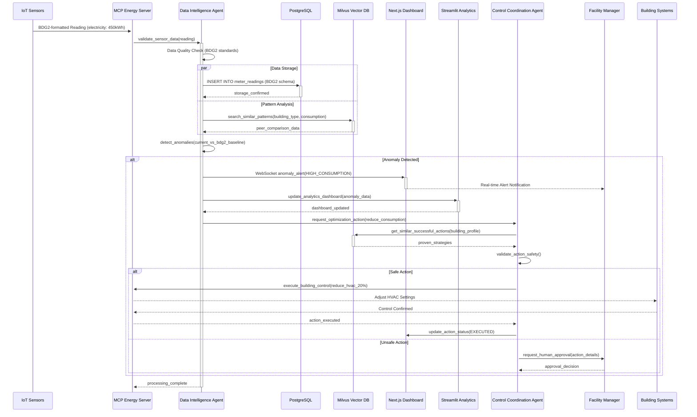
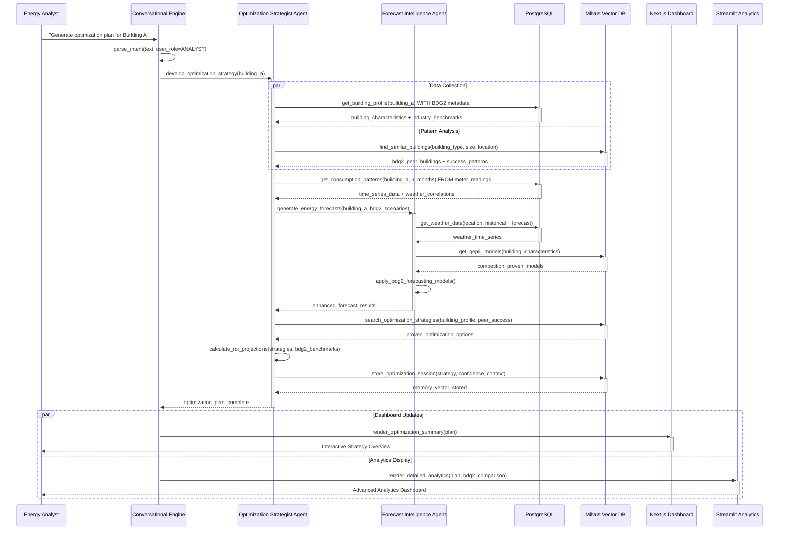
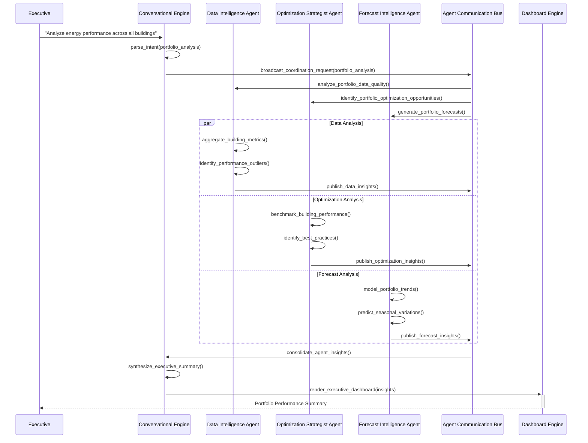
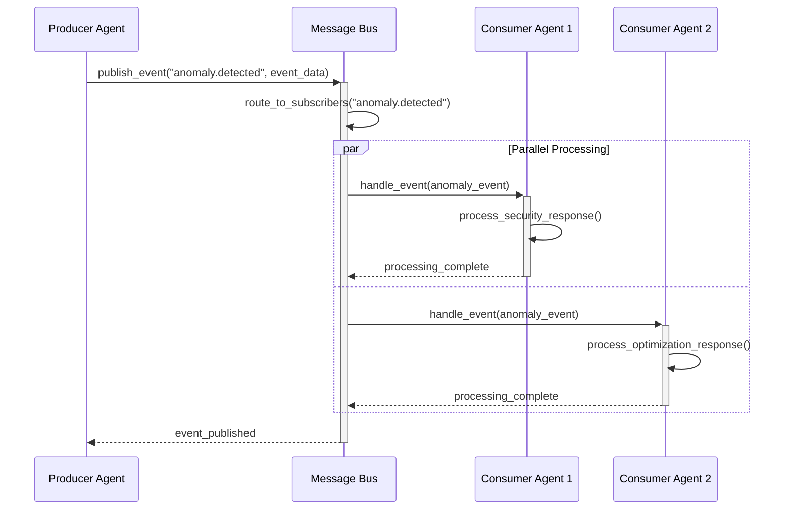

# EAIO Sequence Diagrams
**Architecture Mode (A.*) - Process Flow Design**

## 🎯 Overview

This document defines the key sequence interactions in the EAIO system, showing how business processes translate into system-level communications between agents, components, and external systems.

## 🔄 Core Business Process Sequences

### 1. Real-Time Energy Anomaly Detection & Response (BDG2 Enhanced)



### 2. Strategic Energy Optimization Planning (BDG2 + Enhanced Stack)



### 3. Multi-Agent Collaboration for Portfolio Analysis



### 4. MCP Tool Integration & Failover

```mermaid
sequenceDiagram
    participant Agent as Any Agent
    parameter MCPOrch as MCP Orchestrator
    participant MCPServer1 as MCP Energy Server
    participant MCPServer2 as MCP Backup Server
    participant ToolReg as Tool Registry
    participant HealthMon as Health Monitor

    Agent->>+MCPOrch: invoke_tool("get_energy_consumption", params)
    MCPOrch->>+ToolReg: find_server_for_tool("get_energy_consumption")
    ToolReg-->>-MCPOrch: primary_server=MCPServer1
    
    MCPOrch->>+MCPServer1: call_tool("get_energy_consumption", params)
    
    alt Server Available
        MCPServer1-->>-MCPOrch: tool_result(energy_data)
        MCPOrch-->>-Agent: tool_result(energy_data)
    else Server Unavailable
        MCPServer1-->>MCPOrch: connection_timeout
        MCPOrch->>+HealthMon: report_server_failure(MCPServer1)
        HealthMon-->>-MCPOrch: failover_recommendation
        
        MCPOrch->>+ToolReg: find_backup_server("get_energy_consumption")
        ToolReg-->>-MCPOrch: backup_server=MCPServer2
        
        MCPOrch->>+MCPServer2: call_tool("get_energy_consumption", params)
        MCPServer2-->>-MCPOrch: tool_result(energy_data)
        MCPOrch-->>-Agent: tool_result(energy_data)
        
        MCPOrch->>HealthMon: update_server_status(MCPServer1=DOWN)
    end
```

### 5. Local LLM Model Loading & Resource Management

```mermaid
sequenceDiagram
    participant Agent as Agent Request
    participant LMM as Local Model Manager
    participant OS as Operating System
    participant Model1 as Llama-3.2-3B
    participant Model2 as Qwen2.5-7B

    Agent->>+LMM: load_model("qwen2.5-7b-instruct", priority=HIGH)
    LMM->>LMM: check_memory_availability(7GB_required)
    
    alt Sufficient Memory
        LMM->>+OS: allocate_memory(7GB)
        OS-->>-LMM: memory_allocated
        LMM->>+Model2: load_model_weights()
        Model2-->>-LMM: model_ready
        LMM-->>-Agent: LoadedModel(qwen2.5-7b)
    else Insufficient Memory
        LMM->>LMM: identify_least_used_model()
        LMM->>+Model1: unload_model()
        Model1-->>-LMM: model_unloaded
        LMM->>+OS: free_memory(3GB)
        OS-->>-LMM: memory_freed
        
        LMM->>+OS: allocate_memory(7GB)
        OS-->>-LMM: memory_allocated
        LMM->>+Model2: load_model_weights()
        Model2-->>-LMM: model_ready
        LMM-->>-Agent: LoadedModel(qwen2.5-7b)
    end
```

## 🔄 Integration Patterns

### 1. Event-Driven Agent Communication


### 2. Conversational Context Management
```mermaid
sequenceDiagram
    participant User as User
    participant CE as Conversational Engine
    participant LLM as Local LLM
    parameter CS as Context Store
    participant MS as Memory Store

    User->>+CE: "What was the consumption trend last month?"
    CE->>+CS: get_conversation_context(session_id)
    CS-->>-CE: previous_context
    
    CE->>+MS: retrieve_relevant_memories(user_id, query)
    MS-->>-CE: relevant_memories
    
    CE->>CE: build_enhanced_prompt(query + context + memories)
    CE->>+LLM: generate_response(enhanced_prompt)
    LLM-->>-CE: response
    
    CE->>+CS: update_conversation_context(session_id, new_context)
    CS-->>-CE: context_updated
    
    CE-->>-User: "Based on your building portfolio, last month showed..."
```

## 📊 Enhanced Performance Considerations

### Sequence Timing Requirements (BDG2 + Enhanced Stack)
| Process | Target Response Time | Critical Path | Fallback Strategy |
|---------|---------------------|---------------|-------------------|
| Anomaly Detection | <3 minutes | IoT → PostgreSQL → Milvus → Alert | BDG2 baseline comparison |
| Optimization Planning | <90 minutes | Agent collaboration → BDG2 analysis → Recommendations | Pre-computed BDG2 scenarios |
| Portfolio Analysis | <20 minutes | Multi-agent coordination → Vector similarity → Synthesis | Incremental pattern updates |
| MCP Tool Failover | <5 seconds | Health check → Backup selection → Tool execution | Local PostgreSQL cache |
| Model Loading | <20 seconds | Memory management → Model initialization | Keep hot models loaded |
| Vector Search | <50ms | Milvus similarity search | Local pattern cache |
| PostgreSQL Query | <100ms | Time-series + metadata joins | Materialized views |
| Next.js Page Load | <1s | SSR + static generation | CDN + ISR |
| Streamlit Dashboard | <2s | Analytics computation | Cached computations |

### Enhanced Scalability Patterns
- **Database Optimization**: PostgreSQL read replicas, Milvus index tuning
- **Vector Similarity**: Parallel search across collections, intelligent caching
- **Frontend Performance**: Next.js ISR, Streamlit selective reruns
- **BDG2 Integration**: Batch processing, materialized views for common queries
- **Memory Management**: Intelligent model swapping, connection pooling 