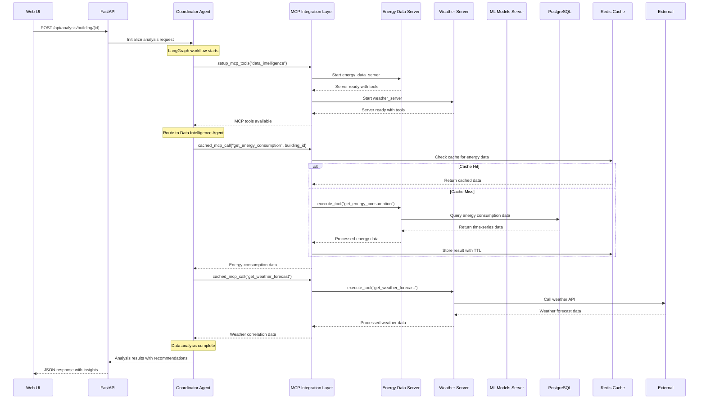
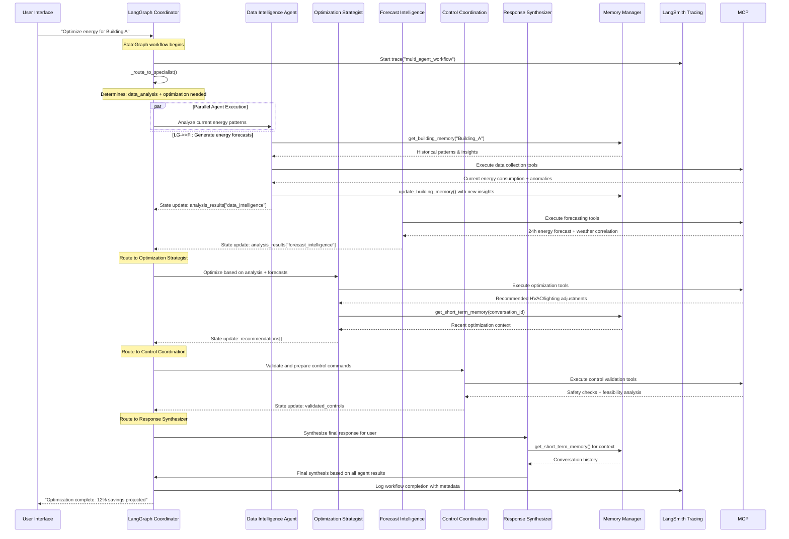
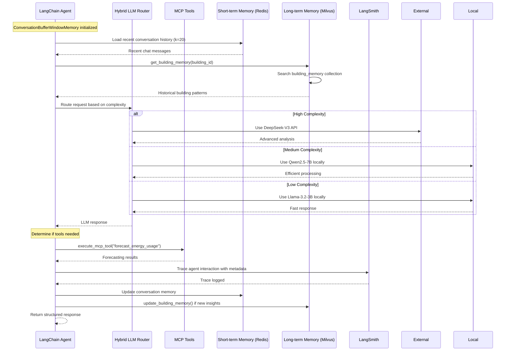
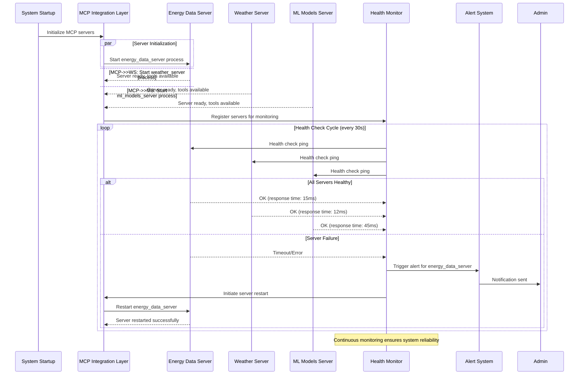

# EAIO Sequence Diagrams
**Architecture Mode (A.*) - Process Flow Design**

## 🎯 Overview

This document defines the key sequence interactions in the EAIO system, showing how business processes translate into system-level communications between agents, components, and external systems.

## 🔄 Core Business Process Sequences

### 1. Real-Time Energy Anomaly Detection & Response (BDG2 Enhanced)


### 2. Strategic Energy Optimization Planning (BDG2 + Enhanced Stack)


### 3. Multi-Agent Collaboration for Portfolio Analysis


### 4. MCP Tool Integration & Failover

```mermaid
sequenceDiagram
    participant Agent as Any Agent
    parameter MCPOrch as MCP Orchestrator
    participant MCPServer1 as MCP Energy Server
    participant MCPServer2 as MCP Backup Server
    participant ToolReg as Tool Registry
    participant HealthMon as Health Monitor

    Agent->>+MCPOrch: invoke_tool("get_energy_consumption", params)
    MCPOrch->>+ToolReg: find_server_for_tool("get_energy_consumption")
    ToolReg-->>-MCPOrch: primary_server=MCPServer1
    
    MCPOrch->>+MCPServer1: call_tool("get_energy_consumption", params)
    
    alt Server Available
        MCPServer1-->>-MCPOrch: tool_result(energy_data)
        MCPOrch-->>-Agent: tool_result(energy_data)
    else Server Unavailable
        MCPServer1-->>MCPOrch: connection_timeout
        MCPOrch->>+HealthMon: report_server_failure(MCPServer1)
        HealthMon-->>-MCPOrch: failover_recommendation
        
        MCPOrch->>+ToolReg: find_backup_server("get_energy_consumption")
        ToolReg-->>-MCPOrch: backup_server=MCPServer2
        
        MCPOrch->>+MCPServer2: call_tool("get_energy_consumption", params)
        MCPServer2-->>-MCPOrch: tool_result(energy_data)
        MCPOrch-->>-Agent: tool_result(energy_data)
        
        MCPOrch->>HealthMon: update_server_status(MCPServer1=DOWN)
    end
```

### 5. Hybrid LLM Request Routing & Fallback

```mermaid
sequenceDiagram
    participant Agent as Energy Agent
    participant LLMRouter as Hybrid LLM Router
    participant LocalOllama as Local Ollama
    participant OpenAI as OpenAI API
    participant DeepSeek as DeepSeek API
    participant Gemini as Gemini API
    participant CostTracker as Cost Tracker
    participant PrivacyFilter as Privacy Filter

    Agent->>+LLMRouter: llm_request(query, privacy=PRIVATE, complexity=0.8)
    LLMRouter->>+PrivacyFilter: check_privacy_constraints(query, PRIVATE)
    PrivacyFilter-->>-LLMRouter: privacy_level=LOCAL_ONLY
    
    alt Privacy Level = LOCAL_ONLY
        LLMRouter->>+LocalOllama: generate(query, model=qwen2.5-7b)
        LocalOllama-->>-LLMRouter: response(text, tokens=150, cost=0)
        LLMRouter-->>-Agent: llm_response(text, provider=local)
        
    else Privacy Level = ENHANCED
        LLMRouter->>+CostTracker: check_budget_availability()
        CostTracker-->>-LLMRouter: remaining_budget=$500
        
        alt Complexity > 0.7 AND Budget Available
            LLMRouter->>LLMRouter: select_optimal_api(complexity, cost, domain)
            
            par API Selection
                LLMRouter->>+DeepSeek: generate(anonymized_query)
                DeepSeek-->>-LLMRouter: response(text, tokens=200, cost=$0.03)
            and Fallback Ready
                Note over LocalOllama: Standby for API failure
            end
            
            LLMRouter->>+CostTracker: record_usage(DeepSeek, $0.03)
            CostTracker-->>-LLMRouter: usage_recorded
            
        else Budget Exhausted OR Low Complexity
            LLMRouter->>+LocalOllama: generate(query, model=llama3.2-3b)
            LocalOllama-->>-LLMRouter: response(text, tokens=120, cost=0)
        end
        
        LLMRouter-->>-Agent: llm_response(text, provider=deepseek)
        
    else API Failure Scenario
        LLMRouter->>+OpenAI: generate(anonymized_query)
        OpenAI-->>LLMRouter: api_error(rate_limit_exceeded)
        
        Note over LLMRouter: Automatic fallback to local
        LLMRouter->>+LocalOllama: generate(query, model=qwen2.5-7b)
        LocalOllama-->>-LLMRouter: response(text, tokens=180, cost=0)
        LLMRouter-->>-Agent: llm_response(text, provider=local_fallback)
    end
```

### 6. Local LLM Model Loading & Resource Management

```mermaid
sequenceDiagram
    participant Agent as Agent Request
    participant LMM as Local Model Manager
    participant OS as Operating System
    participant Model1 as Llama-3.2-3B
    participant Model2 as Qwen2.5-7B

    Agent->>+LMM: load_model("qwen2.5-7b-instruct", priority=HIGH)
    LMM->>LMM: check_memory_availability(7GB_required)
    
    alt Sufficient Memory
        LMM->>+OS: allocate_memory(7GB)
        OS-->>-LMM: memory_allocated
        LMM->>+Model2: load_model_weights()
        Model2-->>-LMM: model_ready
        LMM-->>-Agent: LoadedModel(qwen2.5-7b)
    else Insufficient Memory
        LMM->>LMM: identify_least_used_model()
        LMM->>+Model1: unload_model()
        Model1-->>-LMM: model_unloaded
        LMM->>+OS: free_memory(3GB)
        OS-->>-LMM: memory_freed
        
        LMM->>+OS: allocate_memory(7GB)
        OS-->>-LMM: memory_allocated
        LMM->>+Model2: load_model_weights()
        Model2-->>-LMM: model_ready
        LMM-->>-Agent: LoadedModel(qwen2.5-7b)
    end
```

## 🔄 Integration Patterns

### 1. Event-Driven Agent Communication


### 2. Conversational Context Management
```mermaid
sequenceDiagram
    participant User as User
    participant CE as Conversational Engine
    participant LLM as Local LLM
    parameter CS as Context Store
    participant MS as Memory Store

    User->>+CE: "What was the consumption trend last month?"
    CE->>+CS: get_conversation_context(session_id)
    CS-->>-CE: previous_context
    
    CE->>+MS: retrieve_relevant_memories(user_id, query)
    MS-->>-CE: relevant_memories
    
    CE->>CE: build_enhanced_prompt(query + context + memories)
    CE->>+LLM: generate_response(enhanced_prompt)
    LLM-->>-CE: response
    
    CE->>+CS: update_conversation_context(session_id, new_context)
    CS-->>-CE: context_updated
    
    CE-->>-User: "Based on your building portfolio, last month showed..."
```

## 📊 Enhanced Performance Considerations

### Sequence Timing Requirements (BDG2 + Enhanced Stack)
| Process | Target Response Time | Critical Path | Fallback Strategy |
|---------|---------------------|---------------|-------------------|
| Anomaly Detection | <3 minutes | IoT → PostgreSQL → Milvus → Alert | BDG2 baseline comparison |
| Optimization Planning | <90 minutes | Agent collaboration → BDG2 analysis → Recommendations | Pre-computed BDG2 scenarios |
| Portfolio Analysis | <20 minutes | Multi-agent coordination → Vector similarity → Synthesis | Incremental pattern updates |
| MCP Tool Failover | <5 seconds | Health check → Backup selection → Tool execution | Local PostgreSQL cache |
| Model Loading | <20 seconds | Memory management → Model initialization | Keep hot models loaded |
| Vector Search | <50ms | Milvus similarity search | Local pattern cache |
| PostgreSQL Query | <100ms | Time-series + metadata joins | Materialized views |
| Next.js Page Load | <1s | SSR + static generation | CDN + ISR |
| Streamlit Dashboard | <2s | Analytics computation | Cached computations |

### Enhanced Scalability Patterns
- **Database Optimization**: PostgreSQL read replicas, Milvus index tuning
- **Vector Similarity**: Parallel search across collections, intelligent caching
- **Frontend Performance**: Next.js ISR, Streamlit selective reruns
- **BDG2 Integration**: Batch processing, materialized views for common queries
- **Memory Management**: Intelligent model swapping, connection pooling 

## 🔄 Overview

This document contains detailed sequence diagrams for key EAIO system interactions, focusing on MCP integration, multi-agent workflows, and LangGraph orchestration.

## Sequence 6: MCP Integration & Tool Execution



## Sequence 7: LangGraph Multi-Agent Workflow



## Sequence 8: LangChain Agent with Memory Integration



## Sequence 11: Hybrid LLM Request Routing & Fallback

```mermaid
sequenceDiagram
    participant Agent as Agent Request
    participant Router as HybridLLMRouter
    participant PC as PrivacyClassifier
    participant CM as CostManager
    participant Local as Local LLM (Llama/Qwen)
    participant OpenAI as OpenAI GPT-4o
    participant DeepSeek as DeepSeek-V3
    participant Gemini as Gemini Pro
    participant Cache as Response Cache

    Agent->>Router: Process energy analysis request
    
    Router->>PC: classify_privacy_level(request)
    PC-->>Router: Privacy level: "ENHANCED"
    
    Router->>CM: check_budget_availability()
    CM-->>Router: Budget status: OK for external APIs
    
    Router->>Router: determine_optimal_provider()
    Note over Router: Task: technical analysis → DeepSeek preferred
    
    Router->>Cache: Check for cached response
    Cache-->>Router: Cache miss
    
    Router->>DeepSeek: Submit request to DeepSeek-V3
    
    alt DeepSeek Success
        DeepSeek-->>Router: Technical analysis response
        Router->>CM: track_usage(provider="deepseek", tokens=1500)
        Router->>Cache: Cache response (TTL: 900s)
    else DeepSeek Failure
        Router->>OpenAI: Fallback to GPT-4o
        alt OpenAI Success
            OpenAI-->>Router: Analysis response
            Router->>CM: track_usage(provider="openai", tokens=1200)
        else OpenAI Failure
            Router->>Local: Final fallback to Qwen2.5-7B
            Local-->>Router: Local analysis response
            Note over Router: Log fallback event for monitoring
        end
    end
    
    Router-->>Agent: Final response with provider metadata
```



## Sequence 12: MCP Server Lifecycle & Health Monitoring



## Performance Metrics

### Expected Response Times
- **MCP Tool Execution**: < 100ms for cached data, < 2s for fresh data
- **LangGraph Workflow**: < 5s for simple analysis, < 30s for complex multi-agent workflows  
- **Memory Operations**: < 50ms for short-term, < 200ms for vector search
- **LLM Routing**: < 10ms for local models, < 2s for external APIs

### Throughput Targets
- **Concurrent Workflows**: 10 simultaneous LangGraph executions
- **MCP Tool Calls**: 100 calls/minute per server
- **Memory Updates**: 50 updates/second to vector database
- **Cache Hit Rate**: > 80% for frequently accessed data 