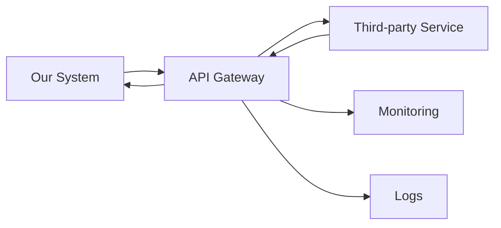
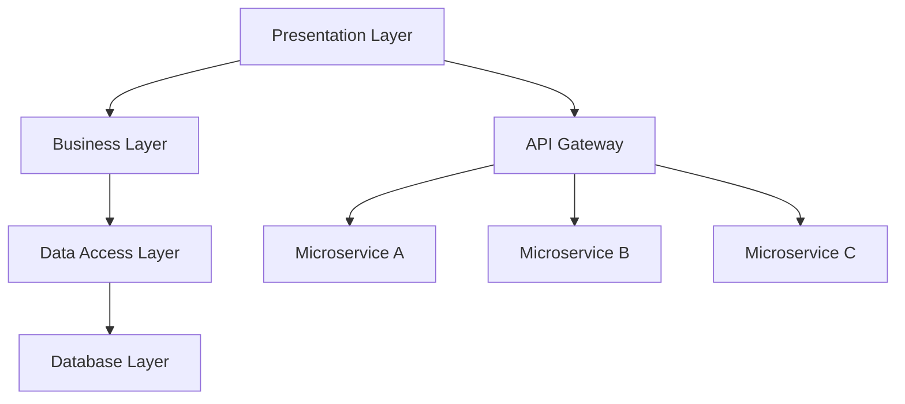
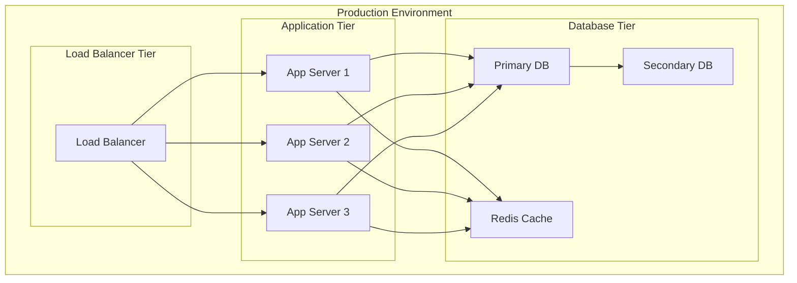
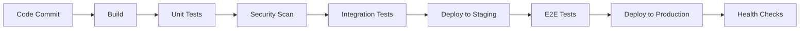

# Confluence Document Templates Collection
*136 Document Templates for Complete Project Documentation*

---

## 📁 00. PROJECT OVERVIEW TEMPLATES

### 📄 Project Charter Template
```markdown
# Project Charter - [PROJECT_NAME]

## Document Properties
- **Document Type:** Charter
- **Status:** Draft/Review/Approved
- **Version:** 1.0
- **Author:** [PM Name]
- **Approver:** [Sponsor Name]
- **Last Updated:** [Date]

## 1. Executive Summary
- **Project Name:** [Name]
- **Project Code:** [Code]
- **Duration:** [Start Date] - [End Date]
- **Budget:** [Amount]
- **Sponsor:** [Name]

## 2. Project Objectives
### Business Objectives
- [Objective 1 with measurable outcome]
- [Objective 2 with measurable outcome]

### Technical Objectives
- [Technical goal 1]
- [Technical goal 2]

## 3. Project Scope
### In Scope
- [Feature/Function 1]
- [Feature/Function 2]

### Out of Scope
- [Excluded item 1]
- [Excluded item 2]

## 4. Success Criteria
| Criteria | Target | Measurement |
|----------|--------|-------------|
| [Metric 1] | [Value] | [How to measure] |
| [Metric 2] | [Value] | [How to measure] |

## 5. High-Level Timeline
| Phase | Duration | Key Deliverables |
|-------|----------|------------------|
| Initiation | [Duration] | [Deliverables] |
| Planning | [Duration] | [Deliverables] |
| Execution | [Duration] | [Deliverables] |

## 6. Budget Summary
| Category | Amount | Notes |
|----------|--------|-------|
| Personnel | [Amount] | [Notes] |
| Infrastructure | [Amount] | [Notes] |
| Third-party | [Amount] | [Notes] |
| **Total** | **[Total]** | |

## 7. Key Stakeholders
| Role | Name | Responsibility |
|------|------|----------------|
| Sponsor | [Name] | [Responsibility] |
| PM | [Name] | [Responsibility] |
| Tech Lead | [Name] | [Responsibility] |

## 8. High-Level Risks
| Risk | Impact | Probability | Mitigation |
|------|--------|-------------|------------|
| [Risk 1] | H/M/L | H/M/L | [Strategy] |

## 9. Assumptions & Constraints
### Assumptions
- [Assumption 1]
- [Assumption 2]

### Constraints
- [Constraint 1]
- [Constraint 2]

## 10. Approval
| Role | Name | Signature | Date |
|------|------|-----------|------|
| Sponsor | [Name] | | |
| PM | [Name] | | |
```

### 📄 Stakeholder Registry Template
```markdown
# Stakeholder Registry - [PROJECT_NAME]

## Document Properties
- **Document Type:** Registry
- **Status:** Living Document
- **Version:** [X.Y]
- **Owner:** [PM Name]
- **Last Updated:** [Date]

## Stakeholder Matrix

| Name | Role | Organization | Interest Level | Influence Level | Communication Preference | Contact Info |
|------|------|--------------|----------------|-----------------|-------------------------|--------------|
| [Name] | [Role] | [Org] | H/M/L | H/M/L | [Email/Phone/Meeting] | [Contact] |

## Stakeholder Analysis

### High Influence, High Interest (Manage Closely)
| Stakeholder | Expectations | Communication Strategy |
|-------------|--------------|------------------------|
| [Name] | [Expectations] | [Strategy] |

### High Influence, Low Interest (Keep Satisfied)
| Stakeholder | Concerns | Engagement Strategy |
|-------------|----------|-------------------|
| [Name] | [Concerns] | [Strategy] |

### Low Influence, High Interest (Keep Informed)
| Stakeholder | Information Needs | Communication Method |
|-------------|-------------------|---------------------|
| [Name] | [Needs] | [Method] |

### Low Influence, Low Interest (Monitor)
| Stakeholder | Monitoring Approach |
|-------------|-------------------|
| [Name] | [Approach] |

## Communication Plan by Stakeholder

### [Stakeholder Name]
- **Frequency:** [Weekly/Monthly]
- **Format:** [Email/Meeting/Report]
- **Content:** [What to communicate]
- **Timing:** [When to communicate]

## Escalation Matrix
| Issue Level | Primary Contact | Secondary Contact | Escalation Timeframe |
|-------------|----------------|-------------------|---------------------|
| Low | [Name] | [Name] | 24 hours |
| Medium | [Name] | [Name] | 4 hours |
| High | [Name] | [Name] | 1 hour |
| Critical | [Name] | [Name] | Immediate |
```

---

## 📁 01. INITIATION TEMPLATES

### 📄 Business Requirements Document (BRD) Template
```markdown
# Business Requirements Document - [PROJECT_NAME]

## Document Properties
- **Document Type:** Requirements
- **Status:** Draft/Review/Approved
- **Version:** [X.Y]
- **Author:** [BA Name]
- **Reviewer:** [Stakeholder]
- **Approver:** [Business Owner]
- **Last Updated:** [Date]

## 1. Executive Summary
### 1.1 Purpose
[Brief description of document purpose]

### 1.2 Business Problem/Opportunity
[Description of business problem or opportunity]

### 1.3 Proposed Solution Overview
[High-level solution description]

## 2. Current State Analysis
### 2.1 Current Business Process
[Description of current process with pain points]

### 2.2 Current System Landscape
[Current systems and their limitations]

### 2.3 Issues and Challenges
| Issue | Impact | Priority |
|-------|--------|----------|
| [Issue 1] | [Impact] | H/M/L |

## 3. Future State Vision
### 3.1 Target Business Process
[Improved process description]

### 3.2 Expected Benefits
| Benefit | Measurement | Target Value |
|---------|-------------|--------------|
| [Benefit 1] | [How to measure] | [Target] |

## 4. Functional Requirements
### 4.1 User Management
- **REQ-001:** [Requirement description]
  - **Priority:** High/Medium/Low
  - **Source:** [Stakeholder/Source]
  - **Acceptance Criteria:**
    - [Criteria 1]
    - [Criteria 2]

### 4.2 [Feature Category 2]
- **REQ-002:** [Requirement description]

## 5. Non-Functional Requirements
### 5.1 Performance Requirements
| Requirement | Target | Measurement |
|-------------|--------|-------------|
| Response Time | < 2 seconds | Average response time |
| Throughput | 1000 TPS | Transactions per second |

### 5.2 Security Requirements
- Authentication requirements
- Authorization requirements
- Data encryption requirements

### 5.3 Usability Requirements
- User interface requirements
- Accessibility requirements

## 6. Business Rules
| Rule ID | Description | Rationale |
|---------|-------------|-----------|
| BR-001 | [Rule description] | [Why this rule exists] |

## 7. Data Requirements
### 7.1 Data Entities
| Entity | Description | Source | Target |
|--------|-------------|--------|--------|
| [Entity] | [Description] | [Source System] | [Target System] |

### 7.2 Data Quality Requirements
- Accuracy requirements
- Completeness requirements
- Timeliness requirements

## 8. Integration Requirements
| System | Integration Type | Data Flow | Frequency |
|--------|------------------|-----------|-----------|
| [System A] | [API/Batch/Real-time] | [Bidirectional/One-way] | [Frequency] |

## 9. Assumptions and Dependencies
### Assumptions
- [Assumption 1]
- [Assumption 2]

### Dependencies
- [Dependency 1]
- [Dependency 2]

## 10. Approval
| Role | Name | Signature | Date |
|------|------|-----------|------|
| Business Owner | [Name] | | |
| Key Stakeholder | [Name] | | |
```

### 📄 Technical Feasibility Assessment Template
```markdown
# Technical Feasibility Assessment - [PROJECT_NAME]

## Document Properties
- **Document Type:** Assessment
- **Status:** Draft/Review/Approved
- **Version:** [X.Y]
- **Author:** [Tech Lead Name]
- **Reviewer:** [CTO/Architect]
- **Last Updated:** [Date]

## 1. Executive Summary
### 1.1 Assessment Overview
[Brief summary of technical feasibility]

### 1.2 Recommendation
- **Feasibility:** ✅ Feasible / ⚠️ Feasible with Constraints / ❌ Not Feasible
- **Confidence Level:** High/Medium/Low
- **Key Constraints:** [Major constraints]

## 2. Requirements Analysis
### 2.1 Functional Requirements Assessment
| Requirement | Complexity | Feasibility | Technology Choice | Risk Level |
|-------------|------------|-------------|-------------------|------------|
| [Req 1] | H/M/L | ✅/⚠️/❌ | [Technology] | H/M/L |

### 2.2 Non-Functional Requirements Assessment
| NFR | Current Capability | Gap | Solution Approach |
|-----|-------------------|-----|-------------------|
| Performance | [Current] | [Gap] | [Approach] |
| Scalability | [Current] | [Gap] | [Approach] |
| Security | [Current] | [Gap] | [Approach] |

## 3. Technology Assessment
### 3.1 Recommended Technology Stack
| Layer | Technology | Rationale | Risks |
|-------|------------|-----------|-------|
| Frontend | [Technology] | [Why chosen] | [Risks] |
| Backend | [Technology] | [Why chosen] | [Risks] |
| Database | [Technology] | [Why chosen] | [Risks] |
| Infrastructure | [Technology] | [Why chosen] | [Risks] |

### 3.2 Alternative Options Analysis
| Technology | Pros | Cons | Decision |
|------------|------|------|---------|
| [Tech A] | [Pros] | [Cons] | [Selected/Rejected] |

## 4. Architecture Assessment
### 4.1 Proposed Architecture
[High-level architecture description with diagram]

### 4.2 Integration Points
| System | Integration Method | Complexity | Risk |
|--------|-------------------|------------|------|
| [System A] | [API/Batch] | H/M/L | H/M/L |

## 5. Resource Requirements
### 5.1 Skills Assessment
| Skill | Required Level | Current Team | Gap | Mitigation |
|-------|----------------|--------------|-----|------------|
| [Skill 1] | Expert/Advanced/Basic | [Current] | [Gap] | [Plan] |

### 5.2 Infrastructure Requirements
| Component | Specification | Cost Estimate | Timeline |
|-----------|---------------|---------------|----------|
| [Component] | [Specs] | [Cost] | [Timeline] |

## 6. Risk Assessment
| Risk | Probability | Impact | Mitigation Strategy | Owner |
|------|-------------|--------|-------------------|-------|
| [Risk 1] | H/M/L | H/M/L | [Strategy] | [Owner] |

## 7. Timeline and Effort Estimation
### 7.1 High-Level Estimates
| Phase | Duration | Effort (person-days) | Key Activities |
|-------|----------|---------------------|----------------|
| Design | [Duration] | [Effort] | [Activities] |
| Development | [Duration] | [Effort] | [Activities] |
| Testing | [Duration] | [Effort] | [Activities] |
| Deployment | [Duration] | [Effort] | [Activities] |

### 7.2 Critical Path Analysis
[Description of critical path and dependencies]

## 8. Recommendations
### 8.1 Go/No-Go Recommendation
**Recommendation:** [Go/No-Go with rationale]

### 8.2 Success Factors
- [Factor 1]
- [Factor 2]

### 8.3 Next Steps
1. [Step 1]
2. [Step 2]
3. [Step 3]
```

---

## 📁 02. PLANNING TEMPLATES

### 📄 Master Project Plan Template
```markdown
# Master Project Plan - [PROJECT_NAME]

## Document Properties
- **Document Type:** Plan
- **Status:** Draft/Review/Approved
- **Version:** [X.Y]
- **Author:** [PM Name]
- **Approver:** [Sponsor]
- **Last Updated:** [Date]

## 1. Project Overview
### 1.1 Project Summary
[Brief project description and objectives]

### 1.2 Project Scope
[High-level scope statement]

### 1.3 Success Criteria
[Key success metrics and criteria]

## 2. Project Organization
### 2.1 Project Team Structure
```
Project Sponsor: [Name]
├── Project Manager: [Name]
├── Technical Lead: [Name]
├── Business Analyst: [Name]
├── Development Team
│   ├── Senior Developer: [Name]
│   ├── Developer: [Name]
│   └── Developer: [Name]
├── QA Team
│   ├── QA Lead: [Name]
│   └── QA Engineer: [Name]
└── DevOps Engineer: [Name]
```

### 2.2 RACI Matrix
| Activity | PM | Tech Lead | BA | Dev | QA | DevOps |
|----------|----|-----------|----|-----|----|---------| 
| Requirements Gathering | A | C | R | I | I | I |
| Architecture Design | A | R | C | C | I | C |
| Development | A | R | I | R | I | I |
| Testing | A | C | I | C | R | I |
| Deployment | A | C | I | I | C | R |

## 3. Project Phases and Milestones
### 3.1 Phase Overview
| Phase | Start Date | End Date | Duration | Key Deliverables |
|-------|------------|----------|----------|------------------|
| Initiation | [Date] | [Date] | [Duration] | Charter, Requirements |
| Planning | [Date] | [Date] | [Duration] | Architecture, Plans |
| Execution | [Date] | [Date] | [Duration] | Software, Tests |
| Closure | [Date] | [Date] | [Duration] | Documentation, Training |

### 3.2 Major Milestones
| Milestone | Target Date | Criteria | Owner |
|-----------|-------------|----------|-------|
| Project Kickoff | [Date] | Charter approved | PM |
| Requirements Sign-off | [Date] | BRD approved | BA |
| Architecture Approval | [Date] | Architecture reviewed | Tech Lead |
| Development Complete | [Date] | All features coded | Dev Team |
| Testing Complete | [Date] | All tests passed | QA Team |
| Go-Live | [Date] | System in production | PM |

## 4. Work Breakdown Structure (WBS)
### 4.1 Initiation Phase
- 1.1 Project Charter Development
  - 1.1.1 Stakeholder interviews
  - 1.1.2 Charter document creation
  - 1.1.3 Charter approval
- 1.2 Requirements Gathering
  - 1.2.1 Business requirements elicitation
  - 1.2.2 Technical requirements analysis
  - 1.2.3 Requirements documentation

### 4.2 Planning Phase
- 2.1 Architecture Design
  - 2.1.1 System architecture design
  - 2.1.2 Database design
  - 2.1.3 Integration design
- 2.2 Project Planning
  - 2.2.1 Detailed schedule development
  - 2.2.2 Resource planning
  - 2.2.3 Risk planning

### 4.3 Execution Phase
- 3.1 Development
  - 3.1.1 Environment setup
  - 3.1.2 Core functionality development
  - 3.1.3 Integration development
- 3.2 Testing
  - 3.2.1 Unit testing
  - 3.2.2 Integration testing
  - 3.2.3 User acceptance testing

## 5. Resource Management
### 5.1 Team Allocation
| Role | Name | Allocation (%) | Start Date | End Date |
|------|------|----------------|------------|----------|
| PM | [Name] | 100% | [Date] | [Date] |
| Tech Lead | [Name] | 100% | [Date] | [Date] |

### 5.2 Budget Allocation
| Category | Planned | Actual | Variance |
|----------|---------|--------|----------|
| Personnel | $[Amount] | $[Amount] | $[Variance] |
| Infrastructure | $[Amount] | $[Amount] | $[Variance] |
| Software Licenses | $[Amount] | $[Amount] | $[Variance] |
| Training | $[Amount] | $[Amount] | $[Variance] |
| **Total** | **$[Total]** | **$[Total]** | **$[Variance]** |

## 6. Communication Plan
### 6.1 Stakeholder Communication
| Stakeholder | Communication Type | Frequency | Format | Owner |
|-------------|-------------------|-----------|--------|-------|
| Sponsor | Status Report | Weekly | Email | PM |
| Steering Committee | Progress Review | Monthly | Meeting | PM |
| Development Team | Daily Standup | Daily | Meeting | Tech Lead |

### 6.2 Reporting Schedule
| Report | Frequency | Recipients | Content |
|--------|-----------|------------|---------|
| Status Report | Weekly | Stakeholders | Progress, issues, risks |
| Dashboard Update | Daily | Team | KPIs, metrics |
| Executive Summary | Monthly | Leadership | High-level status |

## 7. Risk Management
### 7.1 Risk Register
| Risk ID | Risk Description | Probability | Impact | Risk Score | Mitigation Strategy | Owner |
|---------|------------------|-------------|--------|------------|-------------------|-------|
| R001 | Key developer unavailability | Medium | High | 6 | Cross-training, backup resources | PM |
| R002 | Third-party API changes | Low | Medium | 2 | Regular monitoring, fallback plan | Tech Lead |

### 7.2 Risk Response Strategies
- **Mitigate:** Reduce probability or impact
- **Accept:** Acknowledge and monitor
- **Transfer:** Shift responsibility to third party
- **Avoid:** Change approach to eliminate risk

## 8. Quality Management
### 8.1 Quality Standards
- Code review requirements
- Testing coverage targets
- Documentation standards
- Performance benchmarks

### 8.2 Quality Assurance Activities
| Activity | Frequency | Owner | Success Criteria |
|----------|-----------|-------|------------------|
| Code Reviews | Per PR | Tech Lead | 100% coverage |
| Automated Testing | Per build | QA | 90% pass rate |
| Security Scans | Weekly | DevOps | No critical issues |

## 9. Change Management
### 9.1 Change Control Process
1. Change request submission
2. Impact assessment
3. Change review board evaluation
4. Approval/rejection decision
5. Implementation planning
6. Change implementation
7. Change verification

### 9.2 Change Authority
| Change Type | Authority | Approval Required |
|-------------|-----------|-------------------|
| Scope changes | Sponsor | Formal approval |
| Schedule changes | PM | Stakeholder notification |
| Resource changes | PM | Budget approval |

## 10. Project Closure Criteria
### 10.1 Completion Criteria
- All deliverables completed and accepted
- All testing completed successfully
- User training completed
- Documentation updated
- Project lessons learned captured

### 10.2 Success Metrics
| Metric | Target | Actual | Status |
|--------|--------|--------|--------|
| On-time delivery | 100% | [%] | [Status] |
| Budget adherence | ±5% | [%] | [Status] |
| Quality targets | 95% | [%] | [Status] |
```

---

## 📁 03. EXECUTION TEMPLATES

### 📄 System Analysis Document Template
```markdown
# System Analysis Document - [SYSTEM_NAME]

## Document Properties
- **Document Type:** Analysis
- **Status:** Draft/Review/Approved
- **Version:** [X.Y]
- **Author:** [Analyst Name]
- **Reviewer:** [Tech Lead]
- **Last Updated:** [Date]

## 1. Introduction
### 1.1 Purpose
[Purpose of this document]

### 1.2 Scope
[What is covered in this analysis]

### 1.3 Audience
[Intended readers]

## 2. System Overview
### 2.1 System Context
[How this system fits in the larger ecosystem]

### 2.2 System Boundaries
[What is inside/outside the system]

### 2.3 Key Stakeholders
| Stakeholder | Role | Interest |
|-------------|------|----------|
| [Name] | [Role] | [Interest] |

## 3. Current State Analysis
### 3.1 Existing System Architecture
[Description of current system with diagrams]

### 3.2 Current Data Flow
[How data moves through current system]

### 3.3 Current Business Processes
[Existing processes and workflows]

### 3.4 Pain Points and Issues
| Issue | Impact | Frequency | Priority |
|-------|--------|-----------|----------|
| [Issue 1] | [Impact] | [Frequency] | H/M/L |

## 4. Requirements Analysis
### 4.1 Functional Requirements
#### 4.1.1 User Management
- **REQ-F001:** User registration and authentication
  - **Description:** [Detailed description]
  - **Business Rule:** [Associated business rules]
  - **Acceptance Criteria:**
    - [Criteria 1]
    - [Criteria 2]
  - **Priority:** High/Medium/Low
  - **Dependencies:** [Other requirements]

#### 4.1.2 [Other Functional Areas]
[Similar structure for other functional requirements]

### 4.2 Non-Functional Requirements
#### 4.2.1 Performance Requirements
| Requirement | Specification | Measurement |
|-------------|---------------|-------------|
| Response Time | < 2 seconds | 95th percentile |
| Throughput | 1000 TPS | Peak load |
| Concurrent Users | 10,000 | Simultaneous |

#### 4.2.2 Security Requirements
- Authentication mechanisms
- Authorization rules
- Data encryption requirements
- Audit trail requirements

#### 4.2.3 Scalability Requirements
- Horizontal scaling capabilities
- Load distribution mechanisms
- Performance under load

## 5. System Design
### 5.1 Proposed Architecture
[High-level architecture diagram and description]

### 5.2 Component Design
| Component | Responsibility | Technology | Interfaces |
|-----------|----------------|------------|------------|
| [Component A] | [Responsibility] | [Technology] | [Interfaces] |

### 5.3 Data Architecture
#### 5.3.1 Data Model
[Entity relationship diagram and description]

#### 5.3.2 Data Flow
[How data moves through the system]

### 5.4 Integration Architecture
| System | Integration Type | Protocol | Data Format |
|--------|------------------|----------|-------------|
| [System A] | Synchronous | REST API | JSON |
| [System B] | Asynchronous | Message Queue | XML |

## 6. Interface Specifications
### 6.1 User Interfaces
#### 6.1.1 Web Interface
[Description of web UI requirements]

#### 6.1.2 Mobile Interface
[Description of mobile UI requirements]

### 6.2 System Interfaces
#### 6.2.1 API Interfaces
| Endpoint | Method | Purpose | Request/Response |
|----------|--------|---------|------------------|
| /api/users | GET | Get user list | [Format] |
| /api/users | POST | Create user | [Format] |

### 6.3 Database Interfaces
[Database connection and access patterns]

## 7. Security Analysis
### 7.1 Threat Model
| Threat | Likelihood | Impact | Mitigation |
|--------|------------|--------|------------|
| [Threat 1] | H/M/L | H/M/L | [Mitigation] |

### 7.2 Security Controls
- Authentication controls
- Authorization controls
- Data protection controls
- Network security controls

## 8. Implementation Considerations
### 8.1 Technology Constraints
[Technical limitations and constraints]

### 8.2 Development Approach
[Recommended development methodology]

### 8.3 Testing Strategy
[Approach to testing the system]

## 9. Migration Strategy
### 9.1 Data Migration
[How existing data will be migrated]

### 9.2 System Cutover
[Approach to switching from old to new system]

### 9.3 Rollback Plan
[Plan if migration fails]

## 10. Recommendations
### 10.1 Recommended Solution
[Final recommendation with rationale]

### 10.2 Alternative Approaches
[Other options considered]

### 10.3 Next Steps
1. [Step 1]
2. [Step 2]
3. [Step 3]
```

---

## 📁 80. INTEGRATION & APIs TEMPLATES

### 📄 Third-Party Service Integration Template
```markdown
# [SERVICE_NAME] Integration Guide - [PROJECT_NAME]

## Document Properties
- **Document Type:** Integration
- **Status:** Draft/Review/Approved
- **Version:** [X.Y]
- **Author:** [Integration Lead]
- **Reviewer:** [Tech Lead]
- **Service Provider:** [Provider Name]
- **API Version:** [Version]
- **Environment:** Dev/Staging/Prod
- **Last Updated:** [Date]

## 1. Service Overview
### 1.1 Service Description
**Provider:** [Company Name]
**Service Type:** REST API / SDK / Webhook / GraphQL
**Business Purpose:** [Why we need this service]
**Integration Pattern:** Synchronous / Asynchronous / Batch

### 1.2 Business Case
**Problem Statement:** [What problem this solves]
**Expected Benefits:**
- [Benefit 1 with measurable outcome]
- [Benefit 2 with measurable outcome]

**ROI Analysis:**
- Implementation Cost: $[Amount]
- Monthly Service Cost: $[Amount]
- Expected Savings: $[Amount]
- Payback Period: [Months]

## 2. Technical Architecture
### 2.1 Integration Points
[Diagram showing where this service integrates in our system]

**Integration Components:**
- **Source System:** [Our system component]
- **Target Service:** [Third-party service]
- **Integration Layer:** [API Gateway/Direct/Message Queue]
- **Data Store:** [Where integration data is stored]

### 2.2 Data Flow


**Flow Description:**
1. [Step 1 description]
2. [Step 2 description]
3. [Step 3 description]

### 2.3 Dependencies
**Internal Dependencies:**
- [System A] - [Reason]
- [Service B] - [Reason]

**External Dependencies:**
- [Third-party service] - [Reason]
- [Network connectivity] - [Reason]

## 3. Authentication & Security
### 3.1 Authentication Method
**Type:** API Key / OAuth 2.0 / JWT / Basic Auth

**Configuration:**
```json
{
  "auth_type": "oauth2",
  "client_id": "${CLIENT_ID}",
  "client_secret": "${CLIENT_SECRET}",
  "scope": "read write",
  "token_endpoint": "https://api.service.com/oauth/token"
}
```

### 3.2 Security Requirements
- **Encryption:** TLS 1.2+ for data in transit
- **API Key Storage:** Secure credential management
- **Data Classification:** [PII/Confidential/Public]
- **Compliance:** [GDPR/HIPAA/SOX requirements]

### 3.3 Security Controls
| Control | Implementation | Validation |
|---------|----------------|------------|
| API Key Rotation | Monthly automatic rotation | Automated testing |
| Rate Limiting | 1000 requests/minute | Monitoring alerts |
| Input Validation | Schema validation | Unit tests |

## 4. API Specifications
### 4.1 Base Configuration
**Base URL:** https://api.service.com/v1
**Timeout:** 30 seconds
**Retry Policy:** 3 attempts with exponential backoff

### 4.2 Endpoints
#### 4.2.1 User Management
**Create User**
```
POST /users
Content-Type: application/json
Authorization: Bearer {token}

Request Body:
{
  "name": "string",
  "email": "string",
  "phone": "string"
}

Response (201):
{
  "id": "uuid",
  "name": "string", 
  "email": "string",
  "created_at": "datetime"
}

Error Response (400):
{
  "error": "string",
  "details": ["array of error messages"]
}
```

**Get User**
```
GET /users/{id}
Authorization: Bearer {token}

Response (200):
{
  "id": "uuid",
  "name": "string",
  "email": "string", 
  "status": "active|inactive",
  "created_at": "datetime",
  "updated_at": "datetime"
}
```

### 4.3 Webhook Configuration
**Webhook URL:** https://our-system.com/webhooks/service-name
**Secret:** [Webhook secret for verification]
**Events:**
- user.created
- user.updated
- user.deleted

**Payload Example:**
```json
{
  "event": "user.created",
  "timestamp": "2024-01-01T12:00:00Z",
  "data": {
    "id": "uuid",
    "name": "string",
    "email": "string"
  }
}
```

## 5. Error Handling & Resilience
### 5.1 Error Codes
| HTTP Code | Meaning | Action |
|-----------|---------|---------|
| 400 | Bad Request | Log error, return user-friendly message |
| 401 | Unauthorized | Refresh token, retry |
| 429 | Rate Limited | Exponential backoff, retry |
| 500 | Server Error | Retry with fallback |
| 503 | Service Unavailable | Circuit breaker, fallback |

### 5.2 Retry Strategy
```javascript
const retryConfig = {
  attempts: 3,
  backoff: 'exponential',
  baseDelay: 1000,
  maxDelay: 10000,
  retryCondition: (error) => {
    return error.response?.status >= 500 || 
           error.response?.status === 429;
  }
};
```

### 5.3 Circuit Breaker Pattern
**Failure Threshold:** 5 consecutive failures
**Timeout:** 60 seconds
**Recovery Test:** 1 request every 30 seconds

### 5.4 Fallback Strategy
**Fallback Data Source:** [Local cache/Database/Default values]
**Fallback Behavior:**
- [Action when service unavailable]
- [How to handle partial failures]
- [User experience during outage]

## 6. Rate Limits & Quotas
### 6.1 Service Limits
| Limit Type | Value | Scope | Reset Period |
|------------|-------|-------|--------------|
| Requests/minute | 1000 | Per API key | 1 minute |
| Requests/hour | 50000 | Per API key | 1 hour |
| Requests/day | 1000000 | Per account | 24 hours |

### 6.2 Quota Management
**Current Usage Tracking:**
```javascript
// Check remaining quota
const quotaResponse = await api.get('/quota');
console.log(`Remaining: ${quotaResponse.remaining}/${quotaResponse.limit}`);

// Implement quota-aware requests
if (quotaResponse.remaining < 100) {
  // Switch to batch processing or delay requests
}
```

### 6.3 Cost Optimization
**Cost per Request:** $0.001
**Monthly Estimate:** $[Amount] based on [Expected Volume]
**Cost Monitoring:**
- Daily usage reports
- Budget alerts at 80% threshold
- Automatic throttling at 95% budget

## 7. Testing Strategy
### 7.1 Unit Testing
```javascript
// Mock service responses
const mockService = {
  createUser: jest.fn().mockResolvedValue({
    id: 'test-uuid',
    name: 'Test User',
    email: 'test@example.com'
  }),
  
  getUser: jest.fn().mockResolvedValue({
    id: 'test-uuid',
    name: 'Test User',
    status: 'active'
  })
};

// Test error handling
it('should handle service unavailable', async () => {
  mockService.createUser.mockRejectedValue(
    new Error('Service Unavailable')
  );
  
  const result = await userService.createUser(userData);
  expect(result.error).toBe('Service temporarily unavailable');
});
```

### 7.2 Integration Testing
**Test Environment:** [Sandbox/Staging URL]
**Test Data:** [Test accounts and data]
**Test Scenarios:**
- Happy path flows
- Error conditions
- Rate limiting
- Authentication failures
- Network timeouts

### 7.3 Contract Testing
```javascript
// Pact contract test
const provider = new Pact({
  consumer: 'OurSystem',
  provider: 'ThirdPartyService'
});

it('should get user by ID', async () => {
  await provider
    .given('user exists')
    .uponReceiving('a request for user')
    .withRequest({
      method: 'GET',
      path: '/users/123',
      headers: { 'Authorization': 'Bearer token' }
    })
    .willRespondWith({
      status: 200,
      body: {
        id: '123',
        name: 'Test User'
      }
    });
});
```

## 8. Monitoring & Alerting
### 8.1 Health Checks
**Endpoint:** GET /health
**Frequency:** Every 30 seconds
**Success Criteria:** Response time < 5s, Status 200

### 8.2 Key Metrics
| Metric | Threshold | Alert Level |
|--------|-----------|-------------|
| Response Time | > 5 seconds | Warning |
| Error Rate | > 5% | Critical |
| Availability | < 99% | Critical |
| Rate Limit Usage | > 80% | Warning |

### 8.3 Monitoring Dashboard
**Tools:** [Grafana/DataDog/New Relic]
**Metrics Tracked:**
- Request volume and response times
- Error rates by endpoint
- Rate limit consumption
- Cost tracking
- Success/failure trends

### 8.4 Alerting Rules
```yaml
# Prometheus alerting rules
groups:
- name: service-integration
  rules:
  - alert: ServiceHighErrorRate
    expr: rate(service_requests_failed[5m]) > 0.05
    for: 2m
    labels:
      severity: critical
    annotations:
      summary: "High error rate for {{ $labels.service }}"
      
  - alert: ServiceSlowResponse
    expr: histogram_quantile(0.95, service_response_time) > 5
    for: 5m
    labels:
      severity: warning
```

## 9. Deployment & Operations
### 9.1 Configuration Management
**Environment Variables:**
```bash
# Production
SERVICE_API_URL=https://api.service.com
SERVICE_API_KEY=${SECRET_API_KEY}
SERVICE_TIMEOUT=30000
SERVICE_RETRY_ATTEMPTS=3

# Staging  
SERVICE_API_URL=https://staging-api.service.com
SERVICE_API_KEY=${STAGING_API_KEY}
```

### 9.2 Deployment Steps
1. **Pre-deployment:**
   - Verify credentials in target environment
   - Run integration tests against staging
   - Check service status and planned maintenance

2. **Deployment:**
   - Deploy configuration changes
   - Update service endpoints
   - Restart dependent services
   - Verify health checks

3. **Post-deployment:**
   - Monitor error rates and response times
   - Verify end-to-end functionality
   - Check cost tracking
   - Update documentation

### 9.3 Rollback Procedures
**Rollback Triggers:**
- Error rate > 20%
- Response time > 10 seconds
- Service unavailable for > 5 minutes

**Rollback Steps:**
1. Switch to fallback mode
2. Revert configuration changes
3. Restart services
4. Verify system functionality
5. Investigate and document issues

## 10. Vendor Management
### 10.1 Contacts
**Technical Support:**
- Email: support@service.com
- Phone: +1-555-0123
- Portal: https://support.service.com
- SLA: 4 hours response for critical issues

**Account Management:**
- Account Manager: [Name]
- Email: [email]
- Phone: [phone]
- Monthly review meetings

### 10.2 Service Level Agreement
| Metric | Target | Penalty |
|--------|--------|---------|
| Uptime | 99.9% | 10% service credit |
| Response Time | < 2s (95th percentile) | 5% service credit |
| Support Response | < 4 hours (critical) | $500 credit |

### 10.3 Contract Details
**Contract Period:** [Start Date] - [End Date]
**Renewal Terms:** [Terms]
**Termination Clause:** [Notice period and conditions]
**Data Retention:** [How long data is kept after termination]

## 11. Security & Compliance
### 11.1 Data Privacy
**Data Shared:**
- [Type of data shared with service]
- [PII handling procedures]
- [Data retention policies]

**GDPR Compliance:**
- Right to erasure procedures
- Data portability support
- Consent management

### 11.2 Security Assessments
**Last Security Review:** [Date]
**Findings:**
- [Finding 1] - [Status]
- [Finding 2] - [Status]

**Next Review:** [Date]

### 11.3 Audit Trail
All API calls logged with:
- Timestamp
- User identifier
- Request/response data (excluding sensitive fields)
- Response codes
- Processing time

## 12. Cost Analysis
### 12.1 Cost Breakdown
| Component | Monthly Cost | Annual Cost |
|-----------|--------------|-------------|
| API Calls | $[Amount] | $[Amount] |
| Data Transfer | $[Amount] | $[Amount] |
| Premium Features | $[Amount] | $[Amount] |
| Support Plan | $[Amount] | $[Amount] |
| **Total** | **$[Total]** | **$[Total]** |

### 12.2 Usage Tracking
**Current Usage:** [Volume] requests/month
**Projected Growth:** [%] increase per quarter
**Cost Optimization Opportunities:**
- [Optimization 1]
- [Optimization 2]

## 13. Troubleshooting Guide
### 13.1 Common Issues
**Authentication Failures**
- Symptoms: 401 errors
- Causes: Expired tokens, invalid credentials
- Solutions: Refresh tokens, verify credentials

**Rate Limiting**
- Symptoms: 429 errors
- Causes: Exceeded request limits
- Solutions: Implement backoff, optimize requests

**Timeouts**
- Symptoms: Request timeouts
- Causes: Network issues, service overload
- Solutions: Increase timeout, check network

### 13.2 Debug Procedures
1. Check service status page
2. Verify credentials and configuration
3. Review recent error logs
4. Test with minimal request
5. Contact vendor support if needed

## 14. Appendices
### 14.1 Code Examples
[Additional code examples and snippets]

### 14.2 API Reference
[Links to official API documentation]

### 14.3 Change Log
| Version | Date | Changes | Author |
|---------|------|---------|--------|
| 1.0 | [Date] | Initial version | [Author] |
| 1.1 | [Date] | Added error handling | [Author] |
```

---

## 📁 90. TECHNICAL DOCUMENTATION TEMPLATES

### 📄 Overall System Architecture Template
```markdown
# System Architecture Document - [SYSTEM_NAME]

## Document Properties
- **Document Type:** Architecture
- **Status:** Draft/Review/Approved
- **Version:** [X.Y]
- **Author:** [Architect Name]
- **Reviewer:** [CTO/Senior Architect]
- **Last Updated:** [Date]

## 1. Executive Summary
### 1.1 Architecture Overview
[High-level description of the system architecture]

### 1.2 Key Architectural Decisions
- [Decision 1 with rationale]
- [Decision 2 with rationale]
- [Decision 3 with rationale]

### 1.3 Architecture Principles
- **Scalability:** [How system scales]
- **Reliability:** [How system ensures reliability]
- **Security:** [Security approach]
- **Maintainability:** [How system supports maintenance]

## 2. System Context
### 2.1 Business Context
[How the system supports business objectives]

### 2.2 System Landscape
[How this system fits within the enterprise architecture]

### 2.3 External Dependencies
| System | Relationship | Interface | Criticality |
|--------|--------------|-----------|-------------|
| [System A] | [Type] | [API/DB/File] | H/M/L |

## 3. Architectural Views
### 3.1 Logical View
[Component diagram showing logical structure]



**Components:**
- **Presentation Layer:** [Description]
- **Business Layer:** [Description]
- **Data Access Layer:** [Description]
- **Database Layer:** [Description]

### 3.2 Physical View
[Deployment diagram showing physical infrastructure]



### 3.3 Process View
[Sequence diagrams showing key processes]

### 3.4 Development View
[Package/module structure from developer perspective]

## 4. Technology Architecture
### 4.1 Technology Stack
| Layer | Technology | Version | Rationale |
|-------|------------|---------|-----------|
| Frontend | React | 18.x | [Rationale] |
| Backend | Node.js | 18.x | [Rationale] |
| Database | PostgreSQL | 14.x | [Rationale] |
| Cache | Redis | 7.x | [Rationale] |
| Message Queue | RabbitMQ | 3.x | [Rationale] |

### 4.2 Integration Patterns
| Pattern | Usage | Rationale |
|---------|-------|-----------|
| API Gateway | External access | Centralized security, routing |
| Event Sourcing | Audit trail | Immutable event log |
| CQRS | Read/write separation | Performance optimization |

### 4.3 Data Architecture
#### 4.3.1 Data Storage Strategy
- **Transactional Data:** PostgreSQL
- **Document Data:** MongoDB
- **Cache Data:** Redis
- **Time Series:** InfluxDB

#### 4.3.2 Data Flow
[How data moves through the system]

## 5. Security Architecture
### 5.1 Security Principles
- **Defense in Depth:** Multiple security layers
- **Least Privilege:** Minimum necessary access
- **Zero Trust:** Verify everything

### 5.2 Authentication & Authorization
**Authentication Methods:**
- OAuth 2.0 with JWT tokens
- Multi-factor authentication
- API key authentication for services

**Authorization Model:**
- Role-based access control (RBAC)
- Resource-level permissions
- Dynamic authorization policies

### 5.3 Security Controls
| Control | Implementation | Layer |
|---------|----------------|-------|
| Encryption at Rest | AES-256 | Data |
| Encryption in Transit | TLS 1.3 | Network |
| API Security | Rate limiting, validation | Application |
| Network Security | Firewalls, VPNs | Infrastructure |

## 6. Performance Architecture
### 6.1 Performance Requirements
| Metric | Target | Measurement |
|--------|--------|-------------|
| Response Time | < 200ms | 95th percentile |
| Throughput | 10,000 TPS | Peak load |
| Availability | 99.9% | Monthly uptime |

### 6.2 Performance Strategies
- **Caching:** Multi-layer caching strategy
- **Load Balancing:** Horizontal scaling
- **Database Optimization:** Indexing, partitioning
- **CDN:** Static content delivery

### 6.3 Scalability Design
**Horizontal Scaling:**
- Stateless application design
- Database sharding strategy
- Auto-scaling policies

**Vertical Scaling:**
- Resource allocation strategies
- Performance monitoring and tuning

## 7. Reliability & Availability
### 7.1 High Availability Design
- **Redundancy:** No single points of failure
- **Failover:** Automated failover mechanisms
- **Load Distribution:** Traffic distribution across nodes

### 7.2 Disaster Recovery
**Recovery Objectives:**
- Recovery Time Objective (RTO): 4 hours
- Recovery Point Objective (RPO): 1 hour

**Backup Strategy:**
- Automated daily backups
- Cross-region replication
- Point-in-time recovery capability

### 7.3 Monitoring & Observability
**Monitoring Stack:**
- Metrics: Prometheus + Grafana
- Logging: ELK Stack
- Tracing: Jaeger
- Alerting: PagerDuty

## 8. Integration Architecture
### 8.1 Internal Integration
**Service Communication:**
- Synchronous: REST APIs
- Asynchronous: Message queues
- Event streaming: Apache Kafka

### 8.2 External Integration
| Service | Type | Protocol | Purpose |
|---------|------|----------|---------|
| Payment Gateway | Third-party | REST | Payment processing |
| CRM System | Internal | GraphQL | Customer data |
| Analytics | Third-party | Batch | Reporting |

### 8.3 API Design
**API Standards:**
- RESTful design principles
- OpenAPI 3.0 specifications
- Versioning strategy
- Error handling standards

## 9. Data Architecture
### 9.1 Data Model
[Entity relationship diagrams]

### 9.2 Data Management
**Data Governance:**
- Data quality standards
- Data retention policies
- Privacy compliance (GDPR)

**Data Pipeline:**
- ETL processes
- Real-time streaming
- Data validation and cleansing

### 9.3 Database Design
**Database Strategy:**
- Microservice-specific databases
- Shared reference data
- Event store for audit trail

## 10. DevOps Architecture
### 10.1 CI/CD Pipeline


### 10.2 Infrastructure as Code
**Tools:**
- Terraform for infrastructure provisioning
- Ansible for configuration management
- Docker for containerization
- Kubernetes for orchestration

### 10.3 Environment Strategy
| Environment | Purpose | Configuration |
|-------------|---------|---------------|
| Development | Local development | [Config] |
| Testing | Automated testing | [Config] |
| Staging | Pre-production validation | [Config] |
| Production | Live system | [Config] |

## 11. Compliance & Governance
### 11.1 Regulatory Requirements
- [Regulation 1]: [How addressed]
- [Regulation 2]: [How addressed]

### 11.2 Architecture Governance
**Review Process:**
- Architecture review board
- Design review checkpoints
- Technology approval process

**Standards Compliance:**
- Coding standards
- Security standards
- Documentation standards

## 12. Migration Strategy
### 12.1 Current State
[Description of existing system]

### 12.2 Migration Approach
**Strategy:** [Big bang/Phased/Strangler fig]
**Phases:**
1. [Phase 1 description]
2. [Phase 2 description]
3. [Phase 3 description]

### 12.3 Risk Mitigation
| Risk | Mitigation | Contingency |
|------|------------|-------------|
| [Risk 1] | [Mitigation] | [Contingency] |

## 13. Architecture Decisions
### 13.1 Decision Log
| Decision | Date | Rationale | Alternatives | Impact |
|----------|------|-----------|--------------|--------|
| [Decision 1] | [Date] | [Why] | [What else considered] | [Impact] |

### 13.2 Trade-offs
**Performance vs Cost:**
[Discussion of trade-offs made]

**Consistency vs Availability:**
[Discussion of CAP theorem decisions]

## 14. Future Considerations
### 14.1 Roadmap
- [Future enhancement 1]
- [Future enhancement 2]

### 14.2 Emerging Technologies
[Technologies being evaluated for future adoption]

### 14.3 Technical Debt
| Item | Priority | Effort | Timeline |
|------|----------|--------|----------|
| [Debt 1] | H/M/L | [Effort] | [Timeline] |

## 15. Appendices
### 15.1 Glossary
[Technical terms and definitions]

### 15.2 References
[Links to additional documentation]

### 15.3 Architecture Artifacts
[Links to detailed diagrams and models]
```

---

## 📁 91. MEETING MINUTES TEMPLATES

### 📄 Sprint Planning Meeting Template
```markdown
# Sprint Planning Meeting - Sprint [NUMBER]

## Meeting Information
- **Date:** [Date]
- **Time:** [Start Time] - [End Time]
- **Duration:** [Duration]
- **Location/Platform:** [Physical/Virtual location]
- **Scrum Master:** [Name]
- **Product Owner:** [Name]

## Attendees
- ✅ [Name] - [Role]
- ✅ [Name] - [Role]
- ❌ [Name] - [Role] (Absent)

## Sprint Overview
- **Sprint Number:** [Number]
- **Sprint Duration:** [Start Date] - [End Date]
- **Sprint Goal:** [High-level objective]
- **Team Velocity:** [Previous sprint velocity]
- **Team Capacity:** [Available hours/story points]

## Part 1: Sprint Goal and Backlog Refinement
### Sprint Goal Definition
**Proposed Goal:** [Goal statement]
**Acceptance Criteria:**
- [Criteria 1]
- [Criteria 2]

**Goal Approved:** ✅ Yes / ❌ No
**Final Goal:** [Final agreed goal]

### Product Backlog Review
| Story ID | Title | Priority | Estimate | Status |
|----------|-------|----------|----------|--------|
| [ID] | [Title] | High/Medium/Low | [Points] | Ready/Needs Work |

**Backlog Health:**
- Stories ready for sprint: [Number]
- Stories needing refinement: [Number]
- Dependencies identified: [Number]

## Part 2: Sprint Backlog Creation
### Selected User Stories
| Story ID | Title | Assignee | Estimate | Acceptance Criteria Met |
|----------|-------|----------|----------|------------------------|
| [ID] | [Title] | [Name] | [Points] | ✅ Yes / ❌ No |

### Task Breakdown
#### Story [ID]: [Title]
**Tasks:**
- [ ] [Task 1] - [Assignee] - [Hours]
- [ ] [Task 2] - [Assignee] - [Hours]
- [ ] [Task 3] - [Assignee] - [Hours]

**Dependencies:**
- [Dependency 1]
- [Dependency 2]

**Definition of Done Checklist:**
- [ ] Code complete
- [ ] Unit tests written and passing
- [ ] Code reviewed
- [ ] Integration tests passing
- [ ] Documentation updated

### Sprint Capacity Planning
| Team Member | Availability (%) | Capacity (hours) | Committed (hours) | Buffer |
|-------------|------------------|------------------|-------------------|---------|
| [Name] | [%] | [Hours] | [Hours] | [Hours] |
| **Total** | | **[Hours]** | **[Hours]** | **[Hours]** |

### Risk Assessment
| Risk | Probability | Impact | Mitigation | Owner |
|------|-------------|--------|------------|-------|
| [Risk 1] | H/M/L | H/M/L | [Strategy] | [Name] |

## Part 3: Sprint Logistics
### Daily Standup Schedule
- **Time:** [Time]
- **Location:** [Location/Platform]
- **Format:** [Round robin/Walking the board]

### Sprint Review Planning
- **Date:** [Date]
- **Time:** [Time]
- **Attendees:** [Stakeholders to invite]
- **Demo Environment:** [Which environment]

### Sprint Retrospective Planning
- **Date:** [Date]
- **Time:** [Time]
- **Format:** [Start/Stop/Continue, etc.]

## Decisions Made
1. **Decision:** [Decision description]
   - **Rationale:** [Why this decision]
   - **Impact:** [What this affects]

2. **Decision:** [Decision description]
   - **Rationale:** [Why this decision]
   - **Impact:** [What this affects]

## Action Items
| Action | Owner | Due Date | Status |
|--------|-------|----------|--------|
| [Action 1] | [Name] | [Date] | Open/In Progress/Done |
| [Action 2] | [Name] | [Date] | Open/In Progress/Done |

## Impediments Identified
| Impediment | Impact | Owner | Resolution Plan | Target Date |
|------------|--------|-------|-----------------|-------------|
| [Impediment 1] | [Impact] | [Owner] | [Plan] | [Date] |

## Sprint Metrics
- **Planned Story Points:** [Points]
- **Planned Hours:** [Hours]
- **Number of Stories:** [Count]
- **Team Confidence Level:** [1-10 scale]

## Next Steps
1. [Step 1]
2. [Step 2]
3. [Step 3]

## Meeting Feedback
**What went well:**
- [Item 1]
- [Item 2]

**What could be improved:**
- [Item 1]
- [Item 2]

---
**Meeting Notes Prepared by:** [Name]
**Distribution List:** [Email list]
**Next Meeting:** [Date and purpose]
```

### 📄 Stakeholder Meeting Template
```markdown
# Stakeholder Meeting - [MEETING_PURPOSE]

## Meeting Information
- **Date:** [Date]
- **Time:** [Start Time] - [End Time]
- **Duration:** [Duration]
- **Location/Platform:** [Location]
- **Meeting Chair:** [Name]
- **Note Taker:** [Name]

## Attendees
### Internal Stakeholders
- ✅ [Name] - [Role/Department]
- ✅ [Name] - [Role/Department]
- ❌ [Name] - [Role/Department] (Absent - [Reason])

### External Stakeholders
- ✅ [Name] - [Company/Role]
- ✅ [Name] - [Company/Role]

### Project Team
- ✅ [PM Name] - Project Manager
- ✅ [Name] - [Role]

## Meeting Agenda
1. **Welcome & Introductions** (5 min)
2. **Project Status Update** (15 min)
3. **Key Deliverables Review** (20 min)
4. **Issues & Risks Discussion** (15 min)
5. **Upcoming Milestones** (10 min)
6. **Q&A and Open Discussion** (10 min)
7. **Next Steps & Action Items** (5 min)

## 1. Project Status Update
### Overall Health
**Status:** 🟢 On Track / 🟡 At Risk / 🔴 Off Track

### Key Metrics
| Metric | Target | Actual | Variance | Trend |
|--------|--------|--------|----------|-------|
| Schedule | [Target] | [Actual] | [Variance] | ↑/↓/→ |
| Budget | [Target] | [Actual] | [Variance] | ↑/↓/→ |
| Scope | [Target] | [Actual] | [Variance] | ↑/↓/→ |
| Quality | [Target] | [Actual] | [Variance] | ↑/↓/→ |

### Progress Since Last Meeting
**Completed:**
- [Accomplishment 1]
- [Accomplishment 2]
- [Accomplishment 3]

**In Progress:**
- [Item 1] - [% Complete] - [Expected completion]
- [Item 2] - [% Complete] - [Expected completion]

**Upcoming:**
- [Item 1] - [Start date]
- [Item 2] - [Start date]

## 2. Key Deliverables Review
### Deliverable Status
| Deliverable | Owner | Due Date | Status | Comments |
|-------------|-------|----------|--------|----------|
| [Deliverable 1] | [Owner] | [Date] | ✅/🟡/❌ | [Comments] |
| [Deliverable 2] | [Owner] | [Date] | ✅/🟡/❌ | [Comments] |

### Quality Metrics
| Deliverable | Quality Criteria | Actual | Status |
|-------------|------------------|--------|--------|
| [Deliverable] | [Criteria] | [Actual] | Met/Not Met |

### Stakeholder Feedback
**[Stakeholder Name] Feedback on [Deliverable]:**
- [Feedback point 1]
- [Feedback point 2]

**Response/Action:**
- [How feedback will be addressed]

## 3. Issues & Risks Discussion
### Current Issues
| Issue ID | Description | Impact | Owner | Status | Target Resolution |
|----------|-------------|--------|-------|--------|-------------------|
| I-001 | [Issue description] | H/M/L | [Owner] | Open/In Progress/Resolved | [Date] |

### Risk Status Update
| Risk ID | Description | Probability | Impact | Mitigation Status | Owner |
|---------|-------------|-------------|--------|-------------------|-------|
| R-001 | [Risk description] | H/M/L | H/M/L | [Status] | [Owner] |

### New Risks Identified
**Risk:** [New risk description]
- **Probability:** High/Medium/Low
- **Impact:** High/Medium/Low
- **Mitigation Strategy:** [Strategy]
- **Owner:** [Name]

### Escalations Required
**Escalation:** [Description]
- **To:** [Who needs to be involved]
- **By When:** [Date]
- **Action Required:** [What needs to be done]

## 4. Upcoming Milestones
### Next 30 Days
| Milestone | Date | Deliverables | Dependencies | Risk Level |
|-----------|------|--------------|--------------|------------|
| [Milestone 1] | [Date] | [Deliverables] | [Dependencies] | H/M/L |

### Next 60-90 Days
| Milestone | Date | Deliverables | Dependencies | Risk Level |
|-----------|------|--------------|--------------|------------|
| [Milestone 1] | [Date] | [Deliverables] | [Dependencies] | H/M/L |

### Critical Path Activities
1. [Activity 1] - [Dates] - [Owner]
2. [Activity 2] - [Dates] - [Owner]
3. [Activity 3] - [Dates] - [Owner]

## 5. Budget & Resource Update
### Budget Status
| Category | Budgeted | Actual | Remaining | Burn Rate |
|----------|----------|--------|-----------|-----------|
| Personnel | $[Amount] | $[Amount] | $[Amount] | $[Amount]/month |
| Infrastructure | $[Amount] | $[Amount] | $[Amount] | $[Amount]/month |
| Third-party | $[Amount] | $[Amount] | $[Amount] | $[Amount]/month |
| **Total** | **$[Total]** | **$[Total]** | **$[Total]** | **$[Total]/month** |

### Resource Allocation
**Current Team:**
- [Role]: [Name] - [Allocation %]
- [Role]: [Name] - [Allocation %]

**Resource Requests:**
- [Request 1] - [Justification] - [Timeline]
- [Request 2] - [Justification] - [Timeline]

## 6. Change Requests
### Pending Change Requests
| CR ID | Description | Impact | Stakeholder | Status | Decision Date |
|-------|-------------|--------|-------------|--------|---------------|
| CR-001 | [Description] | [Impact] | [Stakeholder] | Pending/Approved/Rejected | [Date] |

### Change Request Discussions
**CR-001: [Description]**
- **Business Justification:** [Justification]
- **Impact Analysis:** [Impact]
- **Stakeholder Discussion:** [Key points discussed]
- **Decision:** [Decision made]
- **Next Steps:** [What happens next]

## 7. Communications & Reporting
### Communication Effectiveness
**Feedback on Current Communication:**
- [Feedback 1]
- [Feedback 2]

**Requested Changes:**
- [Change 1]
- [Change 2]

### Reporting Requirements
| Report | Frequency | Recipients | Next Due |
|--------|-----------|------------|----------|
| [Report 1] | [Frequency] | [Recipients] | [Date] |

## 8. Decisions Made
| Decision | Rationale | Impact | Owner | Implementation Date |
|----------|-----------|--------|-------|-------------------|
| [Decision 1] | [Rationale] | [Impact] | [Owner] | [Date] |

## 9. Action Items
| Action | Owner | Due Date | Priority | Status |
|--------|-------|----------|----------|--------|
| [Action 1] | [Name] | [Date] | H/M/L | Open/In Progress/Done |
| [Action 2] | [Name] | [Date] | H/M/L | Open/In Progress/Done |

## 10. Q&A Summary
**Q:** [Question from stakeholder]
**A:** [Answer provided]
**Follow-up:** [Any follow-up actions needed]

## Next Meeting
- **Date:** [Date]
- **Time:** [Time]
- **Location:** [Location]
- **Agenda Focus:** [Main topics for next meeting]

## Meeting Evaluation
**Meeting Effectiveness (1-5 scale):** [Rating]

**What worked well:**
- [Item 1]
- [Item 2]

**Areas for improvement:**
- [Item 1]
- [Item 2]

---
**Meeting Minutes Prepared by:** [Name]
**Date Prepared:** [Date]
**Distribution:** [Email distribution list]
**Next Review:** [Date for next status review]
```

---

## 📁 92. TEMPLATES & STANDARDS

### 📄 Document Template - Template
```markdown
# [DOCUMENT_TYPE] Template

## Template Metadata
- **Template Version:** [X.Y]
- **Created by:** [Author]
- **Created on:** [Date]
- **Last Updated:** [Date]
- **Approved by:** [Approver]
- **Template Category:** [Category]

## Purpose
This template is designed for [purpose description]. It should be used when [when to use].

## Document Properties Section
*All documents using this template must include:*

```yaml
Document Type: [Type]
Status: [Draft/Review/Approved/Obsolete]
Priority: [P1-Critical/P2-Important/P3-Optional]
Version: [X.Y]
Author: [Name]
Reviewer: [Name]
Approver: [Name]
Last Updated: [YYYY-MM-DD]
Next Review Date: [YYYY-MM-DD]
Related Documents: [Links]
Tags: [comma, separated, tags]
```

## Required Sections
### Section 1: [Section Name]
**Purpose:** [What this section is for]
**Content Guidelines:**
- [Guideline 1]
- [Guideline 2]
- [Guideline 3]

**Template:**
```
[Template content for this section]
```

### Section 2: [Section Name]
**Purpose:** [What this section is for]
**Content Guidelines:**
- [Guideline 1]
- [Guideline 2]

## Optional Sections
### Section A: [Optional Section]
**When to include:** [Conditions when this section should be included]
**Template:**
```
[Template content]
```

## Completion Checklist
Before marking document as complete, ensure:
- [ ] All required sections completed
- [ ] Document properties filled out
- [ ] Content reviewed for accuracy
- [ ] Stakeholder feedback incorporated
- [ ] Related documents linked
- [ ] Document approved by designated approver

## Quality Standards
- **Clarity:** Content should be clear and unambiguous
- **Completeness:** All required information included
- **Consistency:** Follows organizational standards
- **Currency:** Information is up-to-date and relevant

## Review & Approval Process
1. **Author Review:** Self-review for completeness
2. **Peer Review:** Review by subject matter expert
3. **Stakeholder Review:** Review by impacted stakeholders
4. **Final Approval:** Approval by designated authority
5. **Publication:** Document made available to intended audience

## Maintenance
- **Review Frequency:** [How often to review]
- **Update Triggers:** [What triggers an update]
- **Version Control:** [How versions are managed]
- **Archive Process:** [When and how to archive]

## Usage Guidelines
### Do's
- [Do 1]
- [Do 2]
- [Do 3]

### Don'ts
- [Don't 1]
- [Don't 2]
- [Don't 3]

## Examples
### Good Example
[Example of well-completed document using this template]

### Common Mistakes
- [Mistake 1] - [How to avoid]
- [Mistake 2] - [How to avoid]

## Related Resources
- [Link to style guide]
- [Link to document standards]
- [Link to approval workflows]
- [Contact for questions]

---
*This template is part of the organization's document management system. For questions or suggestions for improvement, contact [contact information].*
```

---

## 📊 TEMPLATE USAGE MATRIX

| Document Priority | Usage Frequency | Complexity Level | Review Cycle |
|------------------|-----------------|------------------|--------------|
| **P1 - Critical** | Every project | High | Monthly |
| **P2 - Important** | Most projects | Medium | Quarterly |
| **P3 - Optional** | Some projects | Low | Annually |

## 🎯 IMPLEMENTATION GUIDE

### Phase 1: Critical Templates (Weeks 1-4)
Deploy P1 templates first:
- Project Charter
- BRD Template  
- System Architecture
- Integration Templates
- Meeting Minutes

### Phase 2: Important Templates (Weeks 5-7)
Add P2 templates:
- Test Plans
- Troubleshooting Guides
- Cost Analysis Templates

### Phase 3: Optional Templates (Weeks 8-9)
Complete with P3 templates:
- Archive documentation
- Reference materials

### Template Customization Guidelines
1. **Mandatory Sections:** Cannot be removed
2. **Optional Sections:** Can be omitted if not applicable
3. **Additional Sections:** Can be added for specific needs
4. **Content Guidelines:** Must follow quality standards
5. **Approval Process:** Must be maintained for all documents

---

*Total Templates: 136 covering complete project documentation lifecycle*
*Template Collection Version: 2.0*
*Last Updated: [Current Date]*