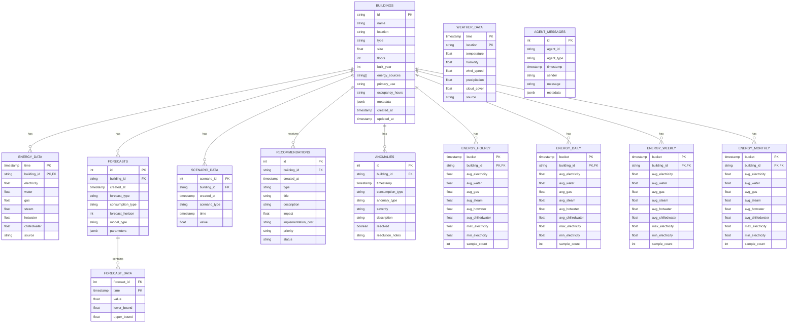

# Energy AI Optimizer Database ERD

## Overview

The Energy AI Optimizer system uses a database architecture designed to efficiently store and query time-series energy data, building information, and agent-generated insights. The system supports both MongoDB (document-based) and PostgreSQL (relational) backends, with TimescaleDB extension for optimized time-series data handling in PostgreSQL.

## Database Schema

The database schema is designed to handle:
1. Building metadata and attributes
2. Time-series energy consumption data
3. Weather data and correlations
4. Forecasts and scenarios
5. Recommendations and implementation plans
6. Anomaly detection results
7. Agent activities and message history

## Entity Relationship Diagram

## Schema Descriptions

### Buildings
Stores information about buildings, including metadata and physical characteristics.

### Energy Data
Stores time-series energy consumption data for various metrics (electricity, water, gas, etc.) for each building. This is a TimescaleDB hypertable optimized for time-series data.

### Weather Data
Stores time-series weather information that can be correlated with energy consumption. This is also a TimescaleDB hypertable.

### Forecasts
Stores metadata about energy consumption forecasts generated for buildings.

### Forecast Data
Stores the actual forecast values, including prediction intervals.

### Scenario Data
Stores different energy consumption scenarios (baseline, optimized, worst-case) for buildings.

### Recommendations
Stores energy optimization recommendations generated by the Recommendation Agent.

### Anomalies
Stores detected anomalies in energy consumption patterns.

### Agent Messages
Stores the history of messages and interactions between agents in the system.

### Energy Aggregates (Hourly, Daily, Weekly, Monthly)
TimescaleDB continuous aggregates that pre-compute time-bucket aggregations of energy data for efficient querying at different time resolutions.

## Data Access Patterns

The database design optimizes for the following access patterns:

1. **Building Information Retrieval**: Quick access to building metadata and characteristics.
2. **Time-Series Data Queries**: Efficient retrieval of energy consumption data over time ranges.
3. **Aggregation Queries**: Pre-computed aggregate views for different time granularities.
4. **Recommendation Retrieval**: Access to energy optimization recommendations by building.
5. **Anomaly Detection**: Identification and storage of abnormal consumption patterns.
6. **Forecasting**: Storage and retrieval of energy consumption predictions.

## TimescaleDB Optimizations

The PostgreSQL implementation uses TimescaleDB features for optimized time-series data handling:

1. **Hypertables**: `energy_data` and `weather_data` are partitioned by time for efficient queries.
2. **Continuous Aggregates**: Pre-computed aggregations at different time resolutions.
3. **Compression Policies**: Automatic compression of older time-series data.
4. **Retention Policies**: Automatic management of data lifecycle.

## Migration Path

The system currently supports both MongoDB and PostgreSQL, with a migration path defined to transition from MongoDB to PostgreSQL. The `db_client.py` module provides a unified interface that abstracts the underlying database implementation. 