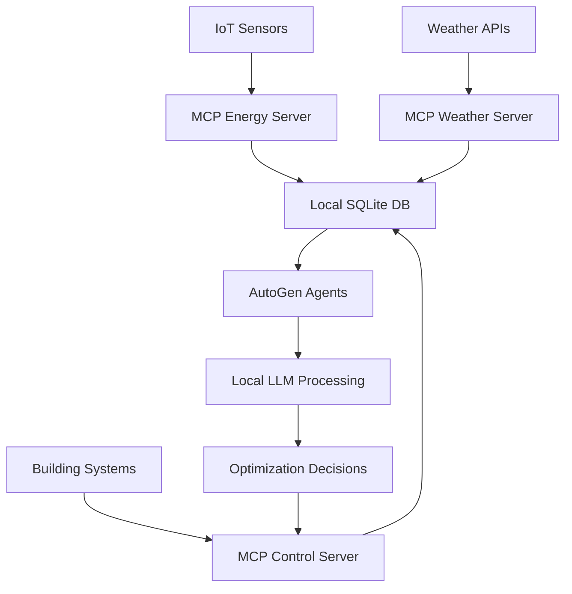

# EAIO-MCP-LLM Integration Architecture
**Architecture Mode (A.*) Design Document**

## 🏗️ Executive Summary

This document presents a comprehensive architecture design for integrating the EAIO (Energy AI Optimizer) system with Model Context Protocol (MCP) and local LLM deployment, optimized for MacBook Pro M1 hardware constraints (16GB RAM).

**Business Objectives:**
- Enable local AI processing for data privacy and performance
- Standardize tool integration through MCP protocol
- Maintain real-time energy optimization capabilities
- Support multi-agent architecture within hardware limitations

---

## 📊 Business Architecture

### Stakeholder Analysis
| Stakeholder | Primary Needs | MCP Integration Benefits |
|-------------|---------------|-------------------------|
| **Energy Managers** | Real-time analytics, anomaly detection | Local processing for sensitive data |
| **Facility Operators** | System control, maintenance alerts | Offline capability, reduced latency |
| **Data Scientists** | Model training, algorithm optimization | Standardized data access through MCP |
| **IT Administrators** | System reliability, security | Simplified tool management |

### Core Business Capabilities Enhanced by MCP
1. **Real-time Energy Monitoring** - MCP tools for sensor data integration
2. **Predictive Analytics** - Local LLM for energy forecasting
3. **Automated Optimization** - MCP-enabled control system integration
4. **Anomaly Detection** - Local processing for immediate response
5. **Report Generation** - MCP tools for data aggregation and visualization

### Value Stream Mapping
```
Data Collection → MCP Tool Processing → Local LLM Analysis → 
Agent Decision Making → System Control → Performance Monitoring
```

---

## 🧠 Application Architecture

### MacBook Pro M1 Optimized Design

#### Layer 1: Local LLM Infrastructure
```yaml
Memory Allocation Strategy (16GB Total):
  - System + OS: 4GB (25%)
  - LLM Model Loading: 8GB (50%)
  - MCP Server Runtime: 2GB (12.5%)
  - Application Logic: 2GB (12.5%)

Selected Models for M1 Optimization:
  Primary: Llama-3.2-3B-Instruct (3GB VRAM)
    - Use: Main reasoning engine
    - Quantization: Q4_K_M for optimal speed/quality
    
  Secondary: Qwen2.5-7B-Instruct (7GB VRAM)
    - Use: Complex analysis tasks
    - Loading: On-demand via model swapping
    
  Specialized: CodeLlama-7B-Instruct (7GB VRAM)
    - Use: Code generation and debugging
    - Loading: Development tasks only
```

#### Layer 2: MCP Integration Framework
```typescript
// MCP Server Configuration for EAIO
export interface EAIOMCPConfig {
  servers: {
    energy_data: {
      command: "python",
      args: ["-m", "eaio_mcp.energy_server"],
      env: { "DATA_PATH": "./data/energy" }
    },
    building_control: {
      command: "uvx",
      args: ["eaio-building-control-mcp"],
      timeout: 30000
    },
    weather_integration: {
      command: "npx",
      args: ["@eaio/weather-mcp-server"],
      env: { "API_KEY": process.env.WEATHER_API_KEY }
    },
    ml_models: {
      command: "python",
      args: ["-m", "eaio_mcp.ml_server"],
      env: { "MODEL_PATH": "./models/" }
    }
  }
}

// Tool Categories
const mcpToolCategories = {
  data_collection: [
    "get_energy_consumption",
    "get_sensor_readings", 
    "get_weather_data"
  ],
  analysis: [
    "detect_anomalies",
    "forecast_energy_usage",
    "calculate_efficiency"
  ],
  control: [
    "adjust_hvac_settings",
    "optimize_lighting",
    "schedule_equipment"
  ]
}
```

#### Layer 3: Multi-Agent Framework (AutoGen + MCP)
```python
# Agent Configuration with MCP Tools
from autogen_ext.tools.mcp import StdioServerParams, mcp_server_tools
from autogen_agentchat.agents import AssistantAgent

class EAIOAgent:
    def __init__(self, agent_type: str, model_config: dict):
        self.agent_type = agent_type
        self.model_config = model_config
        self.mcp_tools = self._setup_mcp_tools()
        
    async def _setup_mcp_tools(self):
        """Setup MCP tools based on agent type"""
        if self.agent_type == "data_manager":
            server_params = StdioServerParams(
                command="python",
                args=["-m", "eaio_mcp.energy_server"],
                read_timeout_seconds=30
            )
        elif self.agent_type == "optimizer":
            server_params = StdioServerParams(
                command="python", 
                args=["-m", "eaio_mcp.control_server"],
                read_timeout_seconds=60
            )
        
        return await mcp_server_tools(server_params)

# Agent Hierarchy for M1 Optimization
agents_config = {
    "coordinator": {
        "model": "llama-3.2-3b-instruct",
        "memory_budget": "1GB",
        "mcp_tools": ["all"]
    },
    "data_manager": {
        "model": "llama-3.2-3b-instruct", 
        "memory_budget": "512MB",
        "mcp_tools": ["data_collection", "analysis"]
    },
    "optimizer": {
        "model": "qwen2.5-7b-instruct",  # On-demand loading
        "memory_budget": "2GB",
        "mcp_tools": ["analysis", "control"]
    }
}
```

---

## 💾 Data Architecture

### Local Data Storage Strategy
```yaml
Database Configuration:
  Primary: SQLite (for M1 efficiency)
    - File: eaio_local.db
    - Size limit: 2GB
    - Indexes: Optimized for time-series queries
    
  Cache: Redis (lightweight deployment)
    - Memory: 256MB allocation
    - Persistence: RDB snapshots only
    - Use: MCP response caching
    
  Time-series: DuckDB
    - File: energy_timeseries.duckdb
    - Compression: Zstandard
    - Partitioning: By day and building_id
```

### MCP Data Integration Pipeline


---

## 🔧 Technology Architecture

### Hardware Optimization for MacBook Pro M1

#### Memory Management Strategy
```python
class MemoryOptimizedLLM:
    def __init__(self):
        self.models = {}
        self.current_model = None
        self.max_memory = 8 * 1024 * 1024 * 1024  # 8GB limit
        
    async def load_model(self, model_name: str):
        """Load model with memory management"""
        if self.current_model and self.current_model != model_name:
            await self._unload_current_model()
            
        if model_name not in self.models:
            model = await self._load_quantized_model(model_name)
            self.models[model_name] = model
            
        self.current_model = model_name
        return self.models[model_name]
        
    async def _load_quantized_model(self, model_name: str):
        """Load model with Apple Metal optimization"""
        return Llama(
            model_path=f"./models/{model_name}.gguf",
            n_ctx=4096,
            n_threads=8,  # M1 Pro has 8 performance cores
            n_gpu_layers=35,  # Use Metal GPU acceleration
            verbose=False
        )
```

#### MCP Server Deployment for M1
```yaml
# Docker Compose for MCP Servers (ARM64 optimized)
version: '3.8'
services:
  energy-mcp-server:
    image: python:3.11-slim-bullseye
    platform: linux/arm64
    volumes:
      - ./eaio_mcp:/app
    command: python -m eaio_mcp.energy_server
    environment:
      - PYTHONPATH=/app
    ports:
      - "8001:8000"
    deploy:
      resources:
        limits:
          memory: 512M
          
  weather-mcp-server:
    image: node:18-alpine
    platform: linux/arm64
    volumes:
      - ./weather_mcp:/app
    command: npm start
    environment:
      - NODE_ENV=production
    ports:
      - "8002:8000"
    deploy:
      resources:
        limits:
          memory: 256M
```

### Performance Optimization
```python
# MCP Tool Caching Strategy
class MCPToolCache:
    def __init__(self, redis_client):
        self.redis = redis_client
        self.cache_ttl = {
            "energy_data": 60,      # 1 minute for real-time data
            "weather_data": 1800,   # 30 minutes for weather
            "building_control": 5   # 5 seconds for control actions
        }
    
    async def cached_tool_call(self, tool_name: str, params: dict):
        """Cache MCP tool responses for performance"""
        cache_key = f"mcp:{tool_name}:{hash(str(params))}"
        
        # Check cache first
        cached_result = await self.redis.get(cache_key)
        if cached_result:
            return json.loads(cached_result)
            
        # Execute MCP tool
        result = await self.execute_mcp_tool(tool_name, params)
        
        # Cache result
        ttl = self.cache_ttl.get(tool_name.split('_')[0], 300)
        await self.redis.setex(cache_key, ttl, json.dumps(result))
        
        return result
```

---

## 🔄 Integration Workflow

### AutoGen + MCP Integration Pattern
```python
# Complete Integration Example
async def setup_eaio_agents():
    """Setup EAIO agents with MCP tools"""
    
    # Setup MCP servers
    energy_mcp = StdioServerParams(
        command="python",
        args=["-m", "eaio_mcp.energy_server"],
        read_timeout_seconds=30
    )
    
    control_mcp = StdioServerParams(
        command="python",
        args=["-m", "eaio_mcp.control_server"], 
        read_timeout_seconds=60
    )
    
    # Get MCP tools
    energy_tools = await mcp_server_tools(energy_mcp)
    control_tools = await mcp_server_tools(control_mcp)
    
    # Create agents
    model_client = OpenAIChatCompletionClient(
        model="llama-3.2-3b-instruct",
        base_url="http://localhost:1234/v1",
        model_info=ModelInfo(
            vision=False, 
            function_calling=True, 
            json_output=True,
            family="llama"
        ),
    )
    
    data_agent = AssistantAgent(
        name="data_manager",
        model_client=model_client,
        tools=energy_tools,
        system_message="""
        You are the Data Manager for EAIO system.
        Use MCP tools to collect and analyze energy data.
        Focus on data quality and real-time processing.
        """
    )
    
    optimizer_agent = AssistantAgent(
        name="optimizer", 
        model_client=model_client,
        tools=control_tools,
        system_message="""
        You are the Energy Optimizer for EAIO system.
        Use MCP tools to control building systems and optimize energy usage.
        Make decisions based on data from the Data Manager.
        """
    )
    
    return [data_agent, optimizer_agent]

# Conversation Pattern
async def run_optimization_cycle():
    """Run energy optimization cycle"""
    agents = await setup_eaio_agents()
    
    # Multi-agent conversation
    await Console(
        GroupChat(
            participants=agents,
            task="Analyze current energy consumption and optimize building systems"
        ).run_stream()
    )
```

---

## 🛡️ Security & Privacy Architecture

### Local-First Security Model
```yaml
Data Privacy:
  - All LLM processing: Local only
  - MCP servers: Localhost binding
  - External APIs: Minimal, encrypted
  - Sensitive data: Never leaves device

Authentication:
  - MCP servers: JWT tokens
  - API access: API keys in secure keychain
  - Inter-agent: Message signing

Encryption:
  - At rest: SQLite encryption
  - In transit: TLS 1.3 for external APIs
  - MCP communication: Local, no encryption needed
```

---

## 📈 Performance Specifications

### Expected Performance Metrics
```yaml
Response Times (M1 MacBook Pro):
  - Simple queries: <500ms
  - Complex analysis: <3s
  - Model switching: <2s
  - MCP tool calls: <1s

Throughput:
  - Concurrent agents: 3-4 maximum
  - Requests/minute: 60-100
  - Data processing: 1000 records/second

Resource Usage:
  - CPU: 60-80% during inference
  - Memory: 12-14GB peak usage
  - Disk I/O: <100MB/hour
  - Network: Minimal (local APIs only)
```

---

## 🚀 Implementation Roadmap

### Phase 1: Foundation (Week 1-2)
- [ ] Setup local LLM infrastructure (Ollama + vLLM)
- [ ] Implement basic MCP servers for EAIO
- [ ] Create AutoGen agent templates
- [ ] Test memory management on M1

### Phase 2: Integration (Week 3-4)
- [ ] Integrate AutoGen with MCP tools
- [ ] Implement agent communication patterns
- [ ] Add performance monitoring
- [ ] Create data pipeline

### Phase 3: Optimization (Week 5-6)
- [ ] Optimize for M1 hardware constraints
- [ ] Implement caching and memory management
- [ ] Add error handling and resilience
- [ ] Performance tuning and testing

### Phase 4: Deployment (Week 7-8)
- [ ] Create deployment scripts
- [ ] Add monitoring and logging
- [ ] Documentation and training
- [ ] Production validation

---

## 🔧 Development Setup Instructions

### Prerequisites for MacBook Pro M1
```bash
# Install Homebrew (if not already installed)
/bin/bash -c "$(curl -fsSL https://raw.githubusercontent.com/Homebrew/install/HEAD/install.sh)"

# Install Python 3.11 (recommended for M1)
brew install python@3.11

# Install Node.js for TypeScript MCP servers
brew install node@18

# Install Redis for caching
brew install redis

# Install Docker for containerized MCP servers
brew install docker
```

### Environment Setup
```bash
# Clone EAIO repository
git clone https://github.com/your-org/EAIO-multiAgent.git
cd EAIO-multiAgent

# Create virtual environment
python3.11 -m venv venv
source venv/bin/activate

# Install dependencies
pip install -r requirements.txt
pip install autogen-agentchat[core]
pip install autogen-ext[tools]

# Install MCP development tools
pip install mcp

# Setup local model directory
mkdir -p models
cd models

# Download optimized models for M1
wget https://huggingface.co/microsoft/Phi-3-mini-4k-instruct-gguf/resolve/main/Phi-3-mini-4k-instruct-q4.gguf
wget https://huggingface.co/Qwen/Qwen2.5-7B-Instruct-GGUF/resolve/main/qwen2.5-7b-instruct-q4_k_m.gguf
```

### Quick Start Guide
```bash
# Start Redis cache
brew services start redis

# Start local LLM server
python -m llama_cpp.server --model ./models/Phi-3-mini-4k-instruct-q4.gguf --host localhost --port 1234

# Start MCP servers
python -m eaio_mcp.energy_server &
python -m eaio_mcp.control_server &

# Run EAIO agents
python examples/eaio_mcp_demo.py
```

---

## 📊 Monitoring & Validation

### Key Performance Indicators
- **Agent Response Time**: Target <2s for 95th percentile
- **Memory Usage**: Stay within 14GB limit
- **MCP Tool Success Rate**: >99%
- **Energy Optimization Accuracy**: >85%

### Monitoring Dashboard
```python
# Simple monitoring setup
import psutil
import time

class SystemMonitor:
    def __init__(self):
        self.metrics = {}
        
    def collect_metrics(self):
        """Collect system performance metrics"""
        return {
            "memory_usage": psutil.virtual_memory().percent,
            "cpu_usage": psutil.cpu_percent(),
            "disk_usage": psutil.disk_usage('/').percent,
            "timestamp": time.time()
        }
        
    def log_agent_performance(self, agent_name: str, response_time: float):
        """Log agent performance metrics"""
        if agent_name not in self.metrics:
            self.metrics[agent_name] = []
        
        self.metrics[agent_name].append({
            "response_time": response_time,
            "timestamp": time.time()
        })
```

---

**Document Version:** 1.0  
**Last Updated:** January 2025  
**Architecture Mode:** A.* - Business-Aligned System Design  
**Target Platform:** MacBook Pro M1 (16GB RAM) 